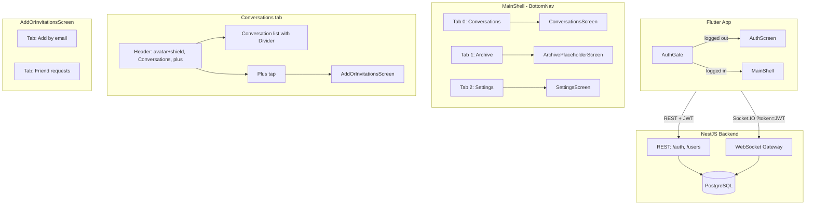
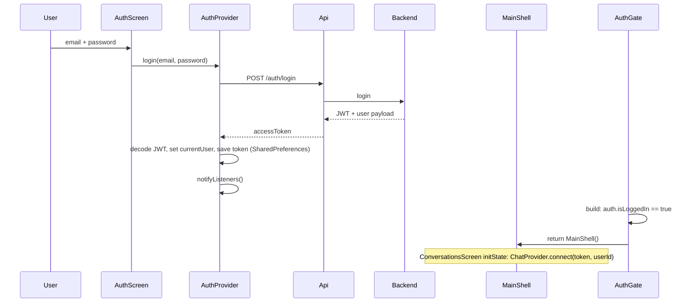
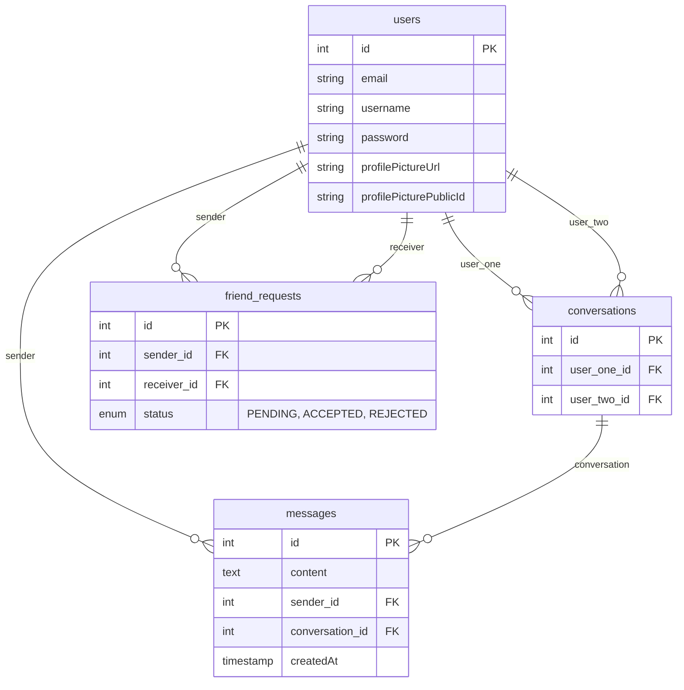

# CLAUDE.md — MVP Chat App

**Last updated:** 2026-02-01

**Rule:** Update this file after every code change. Single source of truth for agents. **A future agent must be able to read ONLY this file and understand the current state of the project without reading every source file.**

**Session rule:** Read `.cursor/session-summaries/LATEST.md` at start; write `YYYY-MM-DD-session.md` and update `LATEST.md` at end. `.cursor/rules/session-summaries.mdc`

**Code rule:** All code in English (vars, functions, comments, commits). `.cursor/rules/code-in-english.mdc`

---

## 1. Critical — Read First

| Rule | Why |
|------|-----|
| **TypeORM relations** | Always `relations: ['sender','receiver']` on friendRequestRepository. Without: empty objects, crashes. |
| **TypeORM .delete()** | Cannot use nested relation conditions. Use find-then-remove: `.find()` then `.remove()`. |
| **Socket.IO (Dart)** | Use `enableForceNew()` when reconnecting with new JWT (logout→login). Caches by URL otherwise. |
| **Provider→Navigator** | `ChatProvider` can't call `Navigator.push`. Use `consumePendingOpen()`: set ID, notifyListeners, screen pops in build. |
| **Multiple backends** | If frontend shows weird data vs backend logs: kill local `node.exe`, use Docker only. |

---

## 2. Quick Start

**Stack:** NestJS + Flutter + PostgreSQL + Socket.IO + JWT. 1-on-1 chat.

**Structure:** `backend/` :3000, `frontend/` :8080 (nginx in Docker). Manual E2E scripts in `scripts/` (see `scripts/README.md`).

**Run:**
```bash
# .env: CLOUDINARY_CLOUD_NAME, CLOUDINARY_API_KEY, CLOUDINARY_API_SECRET
docker-compose up --build
```

**Before run:** `tasklist | findstr node` → kill if needed. One backend only.

**Frontend config:** `BASE_URL` dart define (default localhost:3000). JWT stored in SharedPreferences (`jwt_token`).

---

## 3. Architecture Diagrams

### 3.1 System overview



### 3.2 Post-login navigation flow

```mermaid
flowchart LR
  AuthGate --> |isLoggedIn| MainShell
  MainShell --> |index 0| ConversationsScreen
  MainShell --> |index 1| ArchivePlaceholderScreen
  MainShell --> |index 2| SettingsScreen

  ConversationsScreen --> |plus| AddOrInvitationsScreen
  AddOrInvitationsScreen --> |pop conversationId| ConversationsScreen

  ConversationsScreen --> |tap conversation / mobile| ChatDetailScreen
  ConversationsScreen --> |desktop| ChatDetailScreen embedded

  SettingsScreen --> |Logout| AuthGate
```

- **Mobile:** Bottom nav always visible. Conversations tab = custom header + list. Plus → AddOrInvitationsScreen (push). Tap conversation → push ChatDetailScreen.
- **Desktop:** Same MainShell; ConversationsScreen shows sidebar (header + list) + embedded ChatDetailScreen in right pane. Breakpoint: `AppConstants.layoutBreakpointDesktop` (600px).

### 3.3 Auth flow



**Logout:** User taps Logout in Settings tab → `chat.disconnect()`, `auth.logout()` (clear token + currentUser, notifyListeners). AuthGate rebuilds → `auth.isLoggedIn == false` → return AuthScreen. On logout transition AuthGate also calls `chat.disconnect()` in addPostFrameCallback.

---

## 4. Database Schema

**PostgreSQL, TypeORM `synchronize: true`.**



- **users:** No cascade. Delete account must manually delete dependents (see §8 Backend mechanisms).
- **conversations:** user_one_id, user_two_id → users(id).
- **messages:** conversation_id → conversations(id), sender_id → users(id). Delete conversation: delete messages first, then conversation.
- **friend_requests:** sender_id, receiver_id → users(id). For delete/unfriend use **find-then-remove** (no .delete() with relation conditions).

---

## 5. WebSocket Event Map

**Connection:** Client connects with `?token=JWT` (query or auth). Gateway verifies JWT, loads user, sets `client.data.user = { id, email, username }`. No token or invalid user → disconnect.

**All events below: client emits to server; server may emit back to client and/or to other socket(s).**

| Client emit | Server handler | Server emit (to caller) | Server emit (to others) |
|-------------|----------------|--------------------------|--------------------------|
| **sendMessage** | ChatMessageService.handleSendMessage | `messageSent` (message payload) | To recipient: `newMessage` (same payload) |
| **getMessages** | ChatMessageService.handleGetMessages | `messageHistory` (array of messages) | — |
| **startConversation** | ChatConversationService.handleStartConversation | `conversationsList`, `openConversation` { conversationId } | — |
| **getConversations** | ChatConversationService.handleGetConversations | `conversationsList` (array) | — |
| **startConversation** | ChatConversationService.handleStartConversation | `conversationsList`, `openConversation` { conversationId } | — |
| **deleteConversation** | ChatConversationService.handleDeleteConversation | `conversationsList`, `unfriended` { userId } | To other user: `unfriended` { userId }; then both get new `conversationsList` |
| **sendFriendRequest** | ChatFriendRequestService.handleSendFriendRequest | If pending: `friendRequestSent` (payload). If auto-accept: `friendRequestAccepted`, `friendsList`, `conversationsList`, `openConversation` { conversationId }, `pendingRequestsCount` { count } | To recipient if pending: `newFriendRequest`, `pendingRequestsCount`. If auto-accept: recipient gets `friendRequestAccepted`, `friendsList`, `conversationsList`, `openConversation`, `pendingRequestsCount` |
| **acceptFriendRequest** | ChatFriendRequestService.handleAcceptFriendRequest | `friendRequestAccepted`, `friendsList`, `conversationsList`, `openConversation` { conversationId }, `pendingRequestsCount` | To sender: `friendRequestAccepted`, `friendsList`, `conversationsList`, `openConversation`, `pendingRequestsCount` |
| **rejectFriendRequest** | ChatFriendRequestService.handleRejectFriendRequest | `friendRequestRejected`, `friendRequestsList`, `pendingRequestsCount` | — |
| **getFriendRequests** | ChatFriendRequestService.handleGetFriendRequests | `friendRequestsList` (array) | — |
| **getFriends** | ChatFriendRequestService.handleGetFriends | `friendsList` (array of users) | — |
| **unfriend** | ChatFriendRequestService.handleUnfriend | `unfriended`, `conversationsList` | To other: `unfriended` { userId }, `conversationsList` |

**Payload shapes (essential):**

- **messageSent / newMessage:** `{ id, content, senderId, senderEmail, senderUsername, conversationId, createdAt }`
- **conversationsList:** array of `{ id, userOne, userTwo }` (user objects with id, email, username, profilePictureUrl).
- **openConversation:** `{ conversationId: number }`
- **error:** `{ message: string }`
- **pendingRequestsCount:** `{ count: number }`
- **friendRequestAccepted / newFriendRequest / friendRequestSent:** FriendRequest payload (id, sender, receiver, status).
- **unfriended:** `{ userId: number }` (the peer that was unfriended).

**Client DTOs (backend validates):** SendMessageDto: recipientId, content. SendFriendRequestDto / StartConversationDto: recipientEmail. AcceptFriendRequestDto / RejectFriendRequestDto: requestId. DeleteConversationDto: conversationId. GetMessagesDto: conversationId, optional limit/offset. UnfriendDto: userId.

---

## 6. REST API

| Method | Path | Auth | Body / purpose |
|--------|------|------|----------------|
| POST | /auth/register | — | email, password, username? → 201 |
| POST | /auth/login | — | email, password → { accessToken } + JWT payload (sub, email, username, profilePictureUrl) |
| POST | /users/profile-picture | JWT | multipart file (JPEG/PNG, max 5MB) → update profilePictureUrl, profilePicturePublicId |
| POST | /users/reset-password | JWT | oldPassword, newPassword |
| DELETE | /users/account | JWT | body: { password } → deletes user and all dependents |

**Password rules:** 8+ chars, at least one uppercase, one lowercase, one number.

**Rate limits:** login 5/15min, register 3/h, upload 10/h.

---

## 7. Frontend Mechanisms (Detail)

### 7.1 AuthGate and logout

- **AuthGate** (main.dart): Watches AuthProvider. If `auth.isLoggedIn` → MainShell; else AuthScreen.
- **Logout transition:** When `isLoggedIn` goes true→false, in addPostFrameCallback AuthGate calls `chat.disconnect()` so socket is cleaned up.
- **SettingsScreen Logout:** Calls `chat.disconnect()`, `auth.logout()`. Then `Navigator.pop(context)` only if `Navigator.of(context).canPop()` (so when used as tab in MainShell it does not pop).

### 7.2 ChatProvider.connect and reconnect

- **connect(token, userId):** Cancels any reconnect timer, sets _intentionalDisconnect = false, _tokenForReconnect = token. **Clears all state** (conversations, messages, activeConversationId, lastMessages, pendingOpenConversationId, friendRequests, pendingRequestsCount, friends, errorMessage). notifyListeners(). Disposes old socket if any, then creates new SocketService with **enableForceNew()** and connects. On connect: getConversations(), then notifyListeners().
- **disconnect():** Sets _intentionalDisconnect = true, cancels reconnect timer, then socket.disconnect/dispose/null. No notifyListeners() in disconnect (AuthGate will rebuild anyway).
- **onDisconnect:** If not _intentionalDisconnect and _tokenForReconnect != null, starts reconnect with exponential backoff (max 5 attempts). Reconnect calls connect(_tokenForReconnect, currentUserId).

### 7.3 consumePendingOpen (Provider→Navigator)

- **Problem:** ChatProvider cannot call Navigator.push (no BuildContext).
- **Mechanism:** Backend emits `openConversation` { conversationId }. ChatProvider sets _pendingOpenConversationId = id, notifyListeners(). Screen that is on top of the stack (e.g. AddOrInvitationsScreen or FriendRequestsScreen) in its build() calls `chat.consumePendingOpen()` → returns id and clears it. If id != null, screen does addPostFrameCallback → Navigator.pop(context, id). Caller (ConversationsScreen or AddOrInvitationsScreen) gets result and calls _openChat(id): openConversation(id), then on mobile pushes ChatDetailScreen(conversationId).
- **Where used:** AddOrInvitationsScreen (both tabs), ConversationsScreen (when returning from AddOrInvitationsScreen with result).

### 7.4 consumeFriendRequestSent

- After sendFriendRequest, backend may emit `friendRequestSent`. ChatProvider sets _friendRequestJustSent = true. Add by email tab (or NewChatScreen) in build() calls `chat.consumeFriendRequestSent()`; if true, shows SnackBar and Navigator.pop(context). Used so the “Send Friend Request” flow can close the screen and show success.

### 7.5 Message handling

- **messageSent** (own send) and **newMessage** (incoming): both handled by same _handleIncomingMessage. Updates _lastMessages[conversationId], and if conversation is active adds to _messages, then notifyListeners().

### 7.6 Theme and layout

- **RpgTheme:** themeData (dark), themeDataLight. SettingsProvider.themeMode drives MaterialApp.themeMode. Breakpoint 600px: layoutBreakpointDesktop. Conversations list separator: Divider with convItemBorderDark / convItemBorderLight.

---

## 8. Backend Mechanisms (Detail)

### 8.1 Delete account cascade

- User entity has **no** TypeORM cascade. users.service deleteAccount(userId, password):
  1. Verify password.
  2. Delete Cloudinary avatar if profilePicturePublicId set.
  3. Find all conversations where user is userOne or userTwo. For each: delete messages (messageRepo.delete({ conversation })), then delete conversation.
  4. Find all friend_requests where sender or receiver is userId; **remove(records)** (find-then-remove).
  5. Remove user.

### 8.2 Avatar update (Cloudinary)

- Overwrite uses same public_id. So: only call cloudinary.deleteAvatar(oldPublicId) when **oldPublicId !== newPublicId**. users.service updateProfilePicture: if user.profilePicturePublicId && user.profilePicturePublicId !== publicId then deleteAvatar(old).

### 8.3 FriendRequest relations

- Every find/findOne on friendRequestRepository **must** use `relations: ['sender','receiver']`. Files: friends.service.ts (sendRequest, acceptRequest, rejectRequest, getPendingRequests, getFriends). Otherwise sender/receiver are undefined and UI/backend can crash.

### 8.4 Unfriend / delete friend_requests

- TypeORM .delete() does **not** support nested relation conditions. Use find with where [{ sender: { id: A }, receiver: { id: B } }, { sender: { id: B }, receiver: { id: A } }], then repo.remove(records).

### 8.5 deleteConversation

- chat-conversation.service handleDeleteConversation: must call **friendsService.unfriend(userId, otherUserId)** first (so friend_requests row is removed), then delete messages for conversation, then delete conversation. If unfriend is skipped, FK or logic can break.

### 8.6 Conversation/message delete

- messageRepo.delete({ conversation: { id } }) is valid (single relation). conversations.service uses this before deleting the conversation.

---

## 9. File Map (Where to Edit)

**Backend (NestJS):**

| Change | File(s) |
|--------|--------|
| Auth (register/login) | auth/auth.service.ts, auth.controller.ts, dto |
| User CRUD / profile picture / reset password / delete account | users/users.service.ts, users.controller.ts |
| Delete account cascade | users/users.service.ts (deleteAccount), users.module.ts (repos) |
| Friend request logic | friends/friends.service.ts (relations!), chat/services/chat-friend-request.service.ts |
| Conversation logic | conversations/conversations.service.ts, chat/services/chat-conversation.service.ts |
| Message logic | messages/messages.service.ts, chat/services/chat-message.service.ts |
| WebSocket events (new event) | chat/dto/chat.dto.ts, chat/services/*.ts, chat.gateway.ts |
| Avatar/Cloudinary | cloudinary/cloudinary.service.ts, users/users.controller.ts |

**Frontend (Flutter):**

| Change | File(s) |
|--------|--------|
| App root / auth gate | main.dart |
| Post-login shell / bottom nav | screens/main_shell.dart |
| Conversations list / header / plus | screens/conversations_screen.dart |
| Add by email + Friend requests tabs | screens/add_or_invitations_screen.dart |
| Archive placeholder | screens/archive_placeholder_screen.dart |
| Settings / logout | screens/settings_screen.dart |
| Chat thread UI | screens/chat_detail_screen.dart |
| Socket connection / events | services/socket_service.dart, providers/chat_provider.dart |
| Auth state / login / register | providers/auth_provider.dart, services/api_service.dart |
| Theme / colors | theme/rpg_theme.dart, providers/settings_provider.dart |
| Constants (breakpoint, page size, reconnect) | constants/app_constants.dart |
| Conversation tile / avatar | widgets/conversation_tile.dart, widgets/avatar_circle.dart |

---

## 10. Quick Reference — Find Code

| Task | Location |
|------|----------|
| Friend logic | friends/friends.service.ts + chat/services/chat-friend-request.service.ts |
| Message logic | messages/messages.service.ts + chat/services/chat-message.service.ts |
| Conversation logic | conversations/conversations.service.ts + chat/services/chat-conversation.service.ts |
| Gateway | chat/chat.gateway.ts |
| Add WebSocket event | dto → service handler → gateway @SubscribeMessage → socket_service.dart → chat_provider.dart |
| Add user REST endpoint | users.service → users.controller @UseGuards(JwtAuthGuard) → api_service → auth_provider / settings_screen |
| Add FriendRequest column | friend-request.entity.ts → friend_request_model.dart (TypeORM sync) |
| Settings UI | screens/settings_screen.dart, widgets/dialogs/ |
| Avatar/Cloudinary | cloudinary.service.ts, users.controller.ts, avatar_circle.dart |
| Theme | RpgTheme (themeData, themeDataLight), SettingsProvider |
| Constants | lib/constants/app_constants.dart |
| Auto-open after accept | openConversation → consumePendingOpen() → Navigator.pop(id) → _openChat(id) |
| Nav (post-login) | main.dart AuthGate → MainShell; Conversations tab: custom header, plus → AddOrInvitationsScreen; Settings: Logout |

---

## 11. Critical Gotchas (Summary)

- **TypeORM .delete() with relations:** Use find-then-remove for friend_requests (and any multi-relation condition). Single-relation delete is OK (e.g. messages by conversation).
- **deleteConversation:** Must call unfriend() before deleting conversation.
- **consumePendingOpen:** Set ID in provider, notifyListeners; screen in build() consumes and pops with result.
- **Socket.IO Dart:** enableForceNew() when reconnecting with new JWT.
- **Multiple backends:** Kill local node; use one backend only (Docker or local).

---

## 12. Recent Changes (2026-02-01)

- **Conversations UI redesign:** MainShell + BottomNav (Conversations, Archive, Settings). ConversationsScreen: custom header (avatar+shield, "Conversations", plus with badge); plus → AddOrInvitationsScreen; list separator = Divider. ArchivePlaceholderScreen "Coming soon". Logout only from Settings; SettingsScreen pops only when canPop().
- **Code review / shipping:** Removed dead RpgTheme colors; ChatProvider single _handleIncomingMessage; E2E scripts moved to scripts/.
- **Delete account cascade:** Manual delete of messages → conversations → friend_requests → user. No TypeORM cascade on User.
- **Avatar:** Only deleteAvatar when oldPublicId !== newPublicId (overwrite same id).
- **No isOnline/active status:** Removed; no green dot, no isOnline in payloads.

---

## 13. Environment

| Var | Required | Purpose |
|-----|----------|---------|
| DB_HOST, DB_PORT, DB_USER, DB_PASS, DB_NAME | ✓ | PostgreSQL |
| JWT_SECRET | ✓ | JWT sign |
| CLOUDINARY_CLOUD_NAME, _API_KEY, _API_SECRET | ✓ | Avatars |
| PORT, NODE_ENV, ALLOWED_ORIGINS | — | Optional |

Frontend: BASE_URL dart define (default localhost:3000).

---

## 14. Bug Fix History (Lessons)

- **Delete Account FK:** Cascade delete dependents before user. users.service.ts, users.module.ts.
- **Avatar overwrite:** Skip deleteAvatar when same public_id. users.service.ts.
- **Socket cache:** enableForceNew() + cleanup in connect(). socket_service.dart, chat_provider.dart.
- **Multiple backends:** Kill local node; use one backend.
- **Session leak:** connect() clears state first; AuthGate clears on logout.
- **Unfriend:** find-then-remove. friends.service.ts.
- **deleteConversation:** Call unfriend() first. chat-conversation.service.ts.

---

## 15. Known Limitations

No user search. No typing/read receipts. No message edit/delete. No unique on (sender,receiver) — duplicate friend requests allowed. Last message not in conversationsList (client keeps lastMessages map). Message pagination: limit/offset, default 50.

---

## 16. Tech Debt

- Manual E2E scripts in scripts/ (Node, run against running backend). Not part of shipped app.
- Flutter tests: 9 (AppConstants, UserModel, ConversationModel, widget). `flutter test`.
- Constants in app_constants.dart: layoutBreakpointDesktop, conversationsRefreshDelay, messagePageSize, reconnect*.
- Reconnect: exponential backoff, max 5 attempts; token stored for reconnect; onDisconnect triggers unless intentional logout.

---

**Maintain this file.** After every code change, update the relevant section so an agent reading only CLAUDE.md understands the current state.
