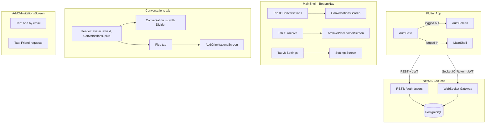
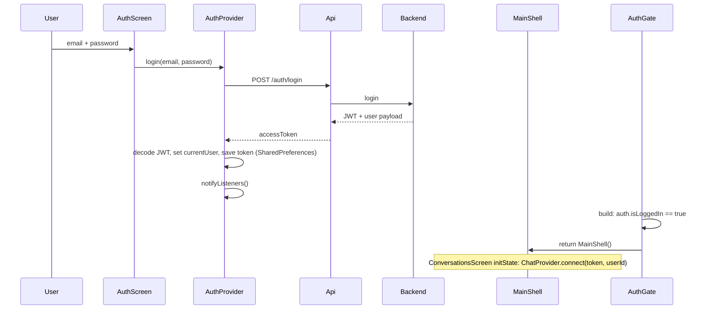
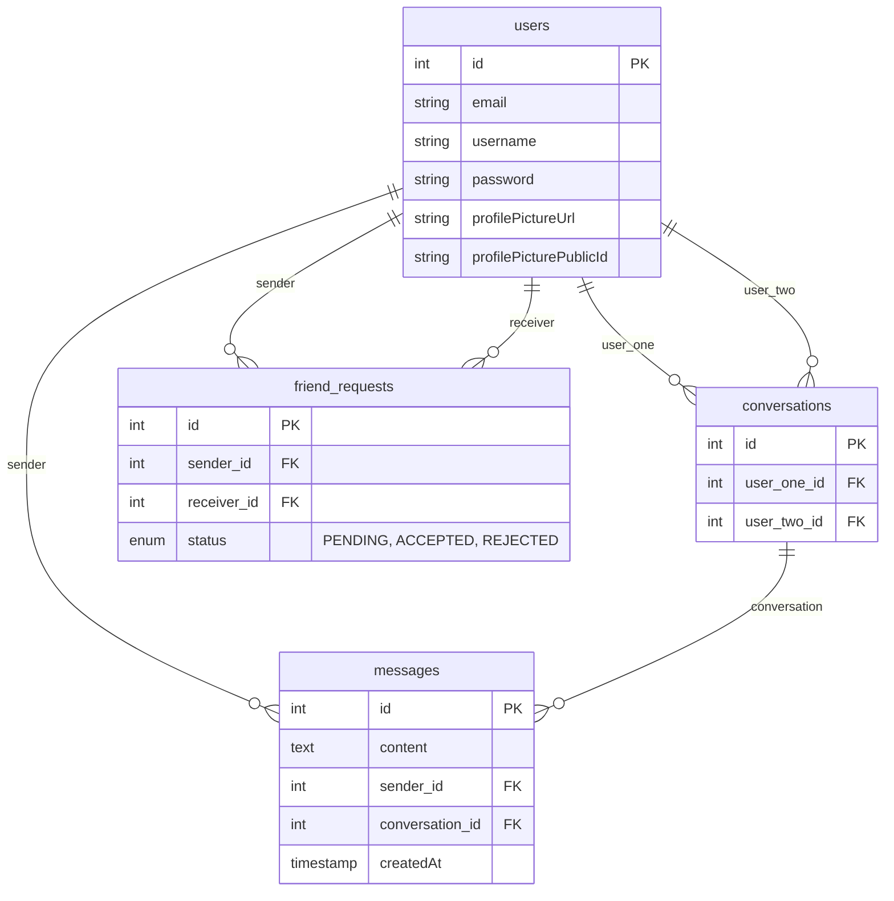

# CLAUDE.md — MVP Chat App

**Last updated:** 2026-02-15

**Rule:** Update this file after every code change. Single source of truth for agents. **A future agent must be able to read ONLY this file and understand the current state of the project without reading every source file.**

**Session rule:** Read `.cursor/session-summaries/LATEST.md` at start; write `YYYY-MM-DD-session.md` and update `LATEST.md` at end. `.cursor/rules/session-summaries.mdc`

**Code rule:** All code in English (vars, functions, comments, commits). If you find Polish in code files (.dart, .ts, .js, etc.), refactor to English. Documentation (.md) can be in Polish. `.cursor/rules/code-in-english.mdc`

---

## 1. Critical — Read First

| Rule | Why |
|------|-----|
| **TypeORM relations** | Always `relations: ['sender','receiver']` on friendRequestRepository. Without: empty objects, crashes. |
| **TypeORM .delete()** | Cannot use nested relation conditions. Use find-then-remove: `.find()` then `.remove()`. |
| **Socket.IO (Dart)** | Use `enableForceNew()` when reconnecting with new JWT (logout→login). Caches by URL otherwise. |
| **Provider→Navigator** | `ChatProvider` can't call `Navigator.push`. Use `consumePendingOpen()`: set ID, notifyListeners, screen pops in build. |
| **Multiple backends** | If frontend shows weird data vs backend logs: kill local `node.exe`, use Docker only. |
| **TypeORM timestamp comparison** | `expiresAt` may be string or Date from pg driver. Always use `new Date(val).getTime()` for comparisons, never `val > new Date()`. |

---

## 2. Quick Start

**Stack:** NestJS + Flutter + PostgreSQL + Socket.IO + JWT. Web-first (dev), mobile later.

**Structure:** `backend/` :3000, `frontend/` Flutter app (web dev mode). Manual E2E scripts in `scripts/` (see `scripts/README.md`).

**Development workflow (current - web focused):**

1. **Start backend + DB** (Terminal 1 - auto hot-reload):
   ```bash
   docker-compose up
   ```
   Backend: http://localhost:3000 (NestJS watch mode - auto reloads on file changes)

2. **Run Flutter web** (Terminal 2 - manual hot-reload):
   ```bash
   cd frontend
   flutter run -d chrome
   ```
   Frontend: http://localhost:<random-port> (check terminal output)
   **Hot-reload:** Press `r` in terminal after code changes (auto hot-reload not working on web)

**Mobile workflow (on hold - network issues):**
   ```bash
   # Will return to this when local network config is resolved
   cd frontend
   flutter devices
   flutter run -d <device-id>  # Auto hot-reload works on mobile
   ```

**Before run:**
- Kill existing node processes: `taskkill //F //IM node.exe`
- **Web dev:** No network config needed (localhost)
- **Mobile dev (later):** Ensure phone/computer on same WiFi, update BASE_URL IP

**Frontend config:** `BASE_URL` defaults to localhost:3000 for web dev. JWT stored in SharedPreferences (`jwt_token`).

---

## 3. Architecture Diagrams

### 3.1 System overview



### 3.2 Post-login navigation flow

```mermaid
flowchart LR
  AuthGate --> |isLoggedIn| MainShell
  MainShell --> |index 0| ConversationsScreen
  MainShell --> |index 1| ContactsScreen
  MainShell --> |index 2| SettingsScreen

  ConversationsScreen --> |plus| AddOrInvitationsScreen
  AddOrInvitationsScreen --> |pop conversationId| ConversationsScreen

  ConversationsScreen --> |tap conversation / mobile| ChatDetailScreen
  ConversationsScreen --> |desktop| ChatDetailScreen embedded

  ContactsScreen --> |tap contact| ChatDetailScreen
  ContactsScreen --> |long-press| Unfriend dialog

  SettingsScreen --> |Logout| AuthGate
```

- **Mobile:** Bottom nav always visible. Conversations tab = custom header + list. Plus → AddOrInvitationsScreen (push). Tap conversation → push ChatDetailScreen. Contacts tab = friends list. Tap contact → open chat; long-press → unfriend dialog.
- **Desktop:** Same MainShell; ConversationsScreen shows sidebar (header + list) + embedded ChatDetailScreen in right pane. Breakpoint: `AppConstants.layoutBreakpointDesktop` (600px).

### 3.3 Auth flow



**Logout:** User taps Logout in Settings tab → `chat.disconnect()`, `auth.logout()` (clear token + currentUser, notifyListeners). AuthGate rebuilds → `auth.isLoggedIn == false` → return AuthScreen. On logout transition AuthGate also calls `chat.disconnect()` in addPostFrameCallback.

---

## 4. Database Schema

**PostgreSQL, TypeORM `synchronize: true`.**



- **users:** No cascade. Delete account must manually delete dependents (see §8 Backend mechanisms).
- **conversations:** user_one_id, user_two_id → users(id).
- **messages:** conversation_id → conversations(id), sender_id → users(id). Delete conversation: delete messages first, then conversation.
- **friend_requests:** sender_id, receiver_id → users(id). For delete/unfriend use **find-then-remove** (no .delete() with relation conditions).

---

## 5. WebSocket Event Map

**Connection:** Client connects with `?token=JWT` (query or auth). Gateway verifies JWT, loads user, sets `client.data.user = { id, email, username }`. No token or invalid user → disconnect.

**All events below: client emits to server; server may emit back to client and/or to other socket(s).**

| Client emit | Server handler | Server emit (to caller) | Server emit (to others) |
|-------------|----------------|--------------------------|--------------------------|
| **sendMessage** | ChatMessageService.handleSendMessage | `messageSent` (message payload) | To recipient: `newMessage` (same payload) |
| **getMessages** | ChatMessageService.handleGetMessages | `messageHistory` (array of messages) | — |
| **startConversation** | ChatConversationService.handleStartConversation | `conversationsList`, `openConversation` { conversationId } | — |
| **getConversations** | ChatConversationService.handleGetConversations | `conversationsList` (array) | — |
| **startConversation** | ChatConversationService.handleStartConversation | `conversationsList`, `openConversation` { conversationId } | — |
| **deleteConversationOnly** | ChatConversationService.handleDeleteConversationOnly | `conversationDeleted` { conversationId }, `conversationsList` | To other user: `conversationDeleted` { conversationId }, `conversationsList` |
| **sendFriendRequest** | ChatFriendRequestService.handleSendFriendRequest | If pending: `friendRequestSent` (payload). If auto-accept: `friendRequestAccepted`, `friendsList`, `conversationsList`, `openConversation` { conversationId }, `pendingRequestsCount` { count } | To recipient if pending: `newFriendRequest`, `pendingRequestsCount`. If auto-accept: recipient gets `friendRequestAccepted`, `friendsList`, `conversationsList`, `openConversation`, `pendingRequestsCount` |
| **acceptFriendRequest** | ChatFriendRequestService.handleAcceptFriendRequest | `friendRequestAccepted`, `friendsList`, `conversationsList`, `openConversation` { conversationId }, `pendingRequestsCount` | To sender: `friendRequestAccepted`, `friendsList`, `conversationsList`, `openConversation`, `pendingRequestsCount` |
| **rejectFriendRequest** | ChatFriendRequestService.handleRejectFriendRequest | `friendRequestRejected`, `friendRequestsList`, `pendingRequestsCount` | — |
| **getFriendRequests** | ChatFriendRequestService.handleGetFriendRequests | `friendRequestsList` (array) | — |
| **getFriends** | ChatFriendRequestService.handleGetFriends | `friendsList` (array of users) | — |
| **unfriend** | ChatFriendRequestService.handleUnfriend | `unfriended`, `conversationsList` | To other: `unfriended` { userId }, `conversationsList` |
| **messageDelivered** | ChatMessageService.handleMessageDelivered | — | To sender: `messageDelivered` { messageId, deliveryStatus: 'DELIVERED' } |
| **markConversationRead** | ChatMessageService.handleMarkConversationRead | — | To each sender of marked messages: `messageDelivered` { messageId, deliveryStatus: 'READ' } |

**Payload shapes (essential):**

- **messageSent / newMessage:** `{ id, content, senderId, senderEmail, senderUsername, conversationId, createdAt }`
- **conversationsList:** array of `{ id, userOne, userTwo }` (user objects with id, email, username, profilePictureUrl).
- **openConversation:** `{ conversationId: number }`
- **conversationDeleted:** `{ conversationId: number }`
- **error:** `{ message: string }`
- **pendingRequestsCount:** `{ count: number }`
- **friendRequestAccepted / newFriendRequest / friendRequestSent:** FriendRequest payload (id, sender, receiver, status).
- **unfriended:** `{ userId: number }` (the peer that was unfriended).

**Client DTOs (backend validates):** SendMessageDto: recipientId, content. SendFriendRequestDto / StartConversationDto: recipientEmail. AcceptFriendRequestDto / RejectFriendRequestDto: requestId. DeleteConversationDto: conversationId. GetMessagesDto: conversationId, optional limit/offset. UnfriendDto: userId. messageDelivered: messageId. markConversationRead: conversationId.

---

## 6. REST API

| Method | Path | Auth | Body / purpose |
|--------|------|------|----------------|
| POST | /auth/register | — | email, password, username? → 201 |
| POST | /auth/login | — | email, password → { accessToken } + JWT payload (sub, email, username, profilePictureUrl) |
| POST | /users/profile-picture | JWT | multipart file (JPEG/PNG, max 5MB) → update profilePictureUrl, profilePicturePublicId |
| POST | /users/reset-password | JWT | oldPassword, newPassword |
| DELETE | /users/account | JWT | body: { password } → deletes user and all dependents |
| POST | /messages/voice | JWT | multipart audio file (AAC/M4A/MP3/WebM, max 10MB), duration (int), expiresIn? (int) → { mediaUrl, publicId, duration } |

**Password rules:** 8+ chars, at least one uppercase, one lowercase, one number.

**Rate limits:** login 5/15min, register 3/h, upload 10/h.

---

## 7. Frontend Mechanisms (Detail)

### 7.1 AuthGate and logout

- **AuthGate** (main.dart): Watches AuthProvider. If `auth.isLoggedIn` → MainShell; else AuthScreen.
- **Logout transition:** When `isLoggedIn` goes true→false, in addPostFrameCallback AuthGate calls `chat.disconnect()` so socket is cleaned up.
- **SettingsScreen Logout:** Calls `chat.disconnect()`, `auth.logout()`. Then `Navigator.pop(context)` only if `Navigator.of(context).canPop()` (so when used as tab in MainShell it does not pop).

### 7.2 ChatProvider.connect and reconnect

- **connect(token, userId):** Cancels any reconnect timer, sets _intentionalDisconnect = false, _tokenForReconnect = token. **Clears all state** (conversations, messages, activeConversationId, lastMessages, pendingOpenConversationId, friendRequests, pendingRequestsCount, friends, errorMessage). notifyListeners(). Disposes old socket if any, then creates new SocketService with **enableForceNew()** and connects. On connect: getConversations(), then notifyListeners().
- **disconnect():** Sets _intentionalDisconnect = true, cancels reconnect timer, then socket.disconnect/dispose/null. No notifyListeners() in disconnect (AuthGate will rebuild anyway).
- **onDisconnect:** If not _intentionalDisconnect and _tokenForReconnect != null, starts reconnect with exponential backoff (max 5 attempts). Reconnect calls connect(_tokenForReconnect, currentUserId).

### 7.3 consumePendingOpen (Provider→Navigator)

- **Problem:** ChatProvider cannot call Navigator.push (no BuildContext).
- **Mechanism:** Backend emits `openConversation` { conversationId }. ChatProvider sets _pendingOpenConversationId = id, notifyListeners(). Screen that is on top of the stack (e.g. AddOrInvitationsScreen or FriendRequestsScreen) in its build() calls `chat.consumePendingOpen()` → returns id and clears it. If id != null, screen does addPostFrameCallback → Navigator.pop(context, id). Caller (ConversationsScreen or AddOrInvitationsScreen) gets result and calls _openChat(id): openConversation(id), then on mobile pushes ChatDetailScreen(conversationId).
- **Where used:** AddOrInvitationsScreen (both tabs), ConversationsScreen (when returning from AddOrInvitationsScreen with result).

### 7.4 consumeFriendRequestSent

- After sendFriendRequest, backend may emit `friendRequestSent`. ChatProvider sets _friendRequestJustSent = true. Add by email tab (or NewChatScreen) in build() calls `chat.consumeFriendRequestSent()`; if true, shows top snackbar and Navigator.pop(context). Used so the “Send Friend Request” flow can close the screen and show success.

### 7.7 Notifications (top snackbar)

- All transient notifications (errors, success, "coming soon") use **showTopSnackBar** from `widgets/top_snackbar.dart` so they appear **at the top** of the screen and do not cover the chat input bar at the bottom. Implemented via Overlay; optional `backgroundColor`; auto-dismiss after 2.5s.

### 7.5 Message handling

- **messageSent** (own send) and **newMessage** (incoming): both handled by same _handleIncomingMessage. Updates _lastMessages[conversationId], and if conversation is active adds to _messages, then notifyListeners().

### 7.6 Theme and layout

- **RpgTheme:** themeData (dark), themeDataLight. SettingsProvider.themeMode drives MaterialApp.themeMode. Breakpoint 600px: layoutBreakpointDesktop. Conversations list separator: Divider with convItemBorderDark / convItemBorderLight.

### 7.8 Delete Conversation vs Unfriend

- **Delete conversation (Conversations tab):** Swipe-to-delete → calls `deleteConversationOnly()` → removes only chat history (messages + conversation entity), preserves friend_request. Friend remains in Contacts tab.
- **Unfriend (Contacts tab):** Long-press → dialog → calls `unfriend(userId)` → removes friend_request + conversation + messages. Total delete, need new friend request to re-connect.
- **Re-opening chat:** After delete conversation, tapping contact in Contacts tab calls `startConversation()` → backend creates new empty conversation (friendship still exists).

---

## 8. Backend Mechanisms (Detail)

### 8.1 Delete account cascade

- User entity has **no** TypeORM cascade. users.service deleteAccount(userId, password):
  1. Verify password.
  2. Delete Cloudinary avatar if profilePicturePublicId set.
  3. Find all conversations where user is userOne or userTwo. For each: delete messages (messageRepo.delete({ conversation })), then delete conversation.
  4. Find all friend_requests where sender or receiver is userId; **remove(records)** (find-then-remove).
  5. Remove user.

### 8.2 Avatar update (Cloudinary)

- Overwrite uses same public_id. So: only call cloudinary.deleteAvatar(oldPublicId) when **oldPublicId !== newPublicId**. users.service updateProfilePicture: if user.profilePicturePublicId && user.profilePicturePublicId !== publicId then deleteAvatar(old).

### 8.3 FriendRequest relations

- Every find/findOne on friendRequestRepository **must** use `relations: ['sender','receiver']`. Files: friends.service.ts (sendRequest, acceptRequest, rejectRequest, getPendingRequests, getFriends). Otherwise sender/receiver are undefined and UI/backend can crash.

### 8.4 Unfriend / delete friend_requests

- TypeORM .delete() does **not** support nested relation conditions. Use find with where [{ sender: { id: A }, receiver: { id: B } }, { sender: { id: B }, receiver: { id: A } }], then repo.remove(records).

### 8.5 deleteConversation

- chat-conversation.service handleDeleteConversation: must call **friendsService.unfriend(userId, otherUserId)** first (so friend_requests row is removed), then delete messages for conversation, then delete conversation. If unfriend is skipped, FK or logic can break.

### 8.6 Conversation/message delete

- messageRepo.delete({ conversation: { id } }) is valid (single relation). conversations.service uses this before deleting the conversation.

---

## 9. File Map (Where to Edit)

**Backend (NestJS):**

| Change | File(s) |
|--------|--------|
| Auth (register/login) | auth/auth.service.ts, auth.controller.ts, dto |
| User CRUD / profile picture / reset password / delete account | users/users.service.ts, users.controller.ts |
| Delete account cascade | users/users.service.ts (deleteAccount), users.module.ts (repos) |
| Friend request logic | friends/friends.service.ts (relations!), chat/services/chat-friend-request.service.ts |
| Conversation logic | conversations/conversations.service.ts, chat/services/chat-conversation.service.ts |
| Message logic | messages/messages.service.ts, chat/services/chat-message.service.ts |
| WebSocket events (new event) | chat/dto/chat.dto.ts, chat/services/*.ts, chat.gateway.ts |
| Avatar/Cloudinary | cloudinary/cloudinary.service.ts, users/users.controller.ts |
| Voice messages upload | messages/messages.controller.ts (POST /messages/voice), cloudinary/cloudinary.service.ts (uploadVoiceMessage) |

**Frontend (Flutter):**

| Change | File(s) |
|--------|--------|
| App root / auth gate | main.dart |
| Post-login shell / bottom nav | screens/main_shell.dart |
| Conversations list / header / plus | screens/conversations_screen.dart |
| Add by email + Friend requests tabs | screens/add_or_invitations_screen.dart |
| Contacts screen | screens/contacts_screen.dart |
| Settings / logout | screens/settings_screen.dart |
| Chat thread UI | screens/chat_detail_screen.dart |
| Delete conversation (history only) | chat/services/chat-conversation.service.ts (handleDeleteConversationOnly), chat_provider.dart, socket_service.dart |
| Swipe-to-delete | widgets/conversation_tile.dart (Dismissible) |
| Socket connection / events | services/socket_service.dart, providers/chat_provider.dart |
| Auth state / login / register | providers/auth_provider.dart, services/api_service.dart |
| Theme / colors | theme/rpg_theme.dart, providers/settings_provider.dart |
| Constants (breakpoint, page size, reconnect) | constants/app_constants.dart |
| Conversation tile / avatar | widgets/conversation_tile.dart, widgets/avatar_circle.dart |
| Top notifications (no bottom SnackBar) | widgets/top_snackbar.dart — use showTopSnackBar() |
| Voice messages (recording) | widgets/voice_recording_overlay.dart, chat_input_bar.dart, chat_provider.dart (sendVoiceMessage, retryVoiceMessage) |
| Voice messages (playback) | widgets/voice_message_bubble.dart, chat_message_bubble.dart (routing) |

---

## 10. Quick Reference — Find Code

| Task | Location |
|------|----------|
| Friend logic | friends/friends.service.ts + chat/services/chat-friend-request.service.ts |
| Message logic | messages/messages.service.ts + chat/services/chat-message.service.ts |
| Conversation logic | conversations/conversations.service.ts + chat/services/chat-conversation.service.ts |
| Gateway | chat/chat.gateway.ts |
| Add WebSocket event | dto → service handler → gateway @SubscribeMessage → socket_service.dart → chat_provider.dart |
| Add user REST endpoint | users.service → users.controller @UseGuards(JwtAuthGuard) → api_service → auth_provider / settings_screen |
| Add FriendRequest column | friend-request.entity.ts → friend_request_model.dart (TypeORM sync) |
| Settings UI | screens/settings_screen.dart, widgets/dialogs/ |
| Avatar/Cloudinary | cloudinary.service.ts, users.controller.ts, avatar_circle.dart |
| Theme | RpgTheme (themeData, themeDataLight), SettingsProvider |
| Constants | lib/constants/app_constants.dart |
| Auto-open after accept | openConversation → consumePendingOpen() → Navigator.pop(id) → _openChat(id) |
| Nav (post-login) | main.dart AuthGate → MainShell; Conversations tab: custom header, plus → AddOrInvitationsScreen; Settings: Logout |

---

## 11. Critical Gotchas (Summary)

- **TypeORM .delete() with relations:** Use find-then-remove for friend_requests (and any multi-relation condition). Single-relation delete is OK (e.g. messages by conversation).
- **deleteConversation:** Must call unfriend() before deleting conversation.
- **consumePendingOpen:** Set ID in provider, notifyListeners; screen in build() consumes and pops with result.
- **Socket.IO Dart:** enableForceNew() when reconnecting with new JWT.
- **Multiple backends:** Kill local node; use one backend only (Docker or local).

---

## 12. Chat Screen Redesign (2026-02-04)

Telegram/Wire-inspired UI with delivery indicators, disappearing messages, ping notifications, and action tiles.

### New Message Features

- **Delivery Status Tracking:** SENDING (clock), SENT (✓ grey), DELIVERED (✓ grey), READ (✓✓ blue) on own messages only. One check = delivered; two checks = read (recipient opened chat). Backend: `MessageDeliveryStatus` (SENDING, SENT, DELIVERED, READ). Client emits `messageDelivered`(messageId) when receiving; emits `markConversationRead`(conversationId) when opening/viewing chat so sender sees read receipts.
- **Disappearing Messages:** Global timer per conversation (30s, 1m, 5m, 1h, 1d, Off). Set via Timer action tile. Messages include `expiresAt` field. **Three-layer expiration:** (1) Frontend `removeExpiredMessages()` called every 1s by ChatDetailScreen timer — instant vanish at zero. (2) Backend cron deletes from DB every minute. (3) `handleGetMessages` + `onMessageHistory` both filter out expired messages.
- **Ping Messages:** One-shot notification with empty content and `messageType=PING`. Backend emits `pingSent` to sender, `newPing` to recipient. UI shows campaign icon + "PING!" text.
- **Message Types:** TEXT, PING, IMAGE, DRAWING, VOICE. IMAGE and DRAWING not fully implemented (no camera/drawing upload endpoints).

### UI Components

- **ChatMessageBubble:** Shows delivery icon (clock/✓/✓✓) + timer countdown if `expiresAt` set. Ping messages display with campaign icon.
- **ChatInputBar:** Arrow toggle for action panel, text field, mic/send toggle. Orange timer indicator bar above input when disappearing timer is active (shows "Disappearing messages: Xm"). Action panel slides open with ChatActionTiles.
- **ChatActionTiles:** Horizontal scroll row with 6 tiles: Timer (dialog with duration options), Ping (sends ping), Camera, Draw, GIF, More (placeholders).
- **AppBar:** Username centered (title), avatar on right (actions), back button (left), three-dot menu (unfriend option).

### Backend Changes

- **Message Entity:** Added `deliveryStatus` (enum), `expiresAt` (timestamp), `messageType` (enum), `mediaUrl` (text nullable).
- **SendMessageDto:** Added `expiresIn` (optional seconds).
- **SendPingDto:** New DTO with `recipientId`.
- **WebSocket Events:** `messageDelivered` (update delivery status), `newPing` (receive ping), `pingSent` (confirm ping sent).
- **ChatMessageService:** `handleSendPing` method creates ping messages with `messageType=PING`.

### Frontend Changes

- **MessageModel:** Added `deliveryStatus`, `expiresAt`, `messageType`, `mediaUrl` fields. Public `parseDeliveryStatus()` method.
- **ChatProvider:** `sendPing()`, `_handleMessageDelivered()`, `_handlePingReceived()`, `conversationDisappearingTimer`, `setConversationDisappearingTimer()`. Optimistic message updates with SENDING status. Emits `messageDelivered` when receiving messages.
- **SocketService:** `sendPing()`, `emitMessageDelivered()`, updated `sendMessage()` signature with `expiresIn`.
- **Dependencies:** `emoji_picker_flutter ^2.0.0`.

### Files Modified

- Backend: `message.entity.ts`, `messages.service.ts`, `chat-message.service.ts`, `chat.dto.ts`, `send-ping.dto.ts` (new), `chat.gateway.ts`
- Frontend: `message_model.dart`, `chat_provider.dart`, `socket_service.dart`, `chat_input_bar.dart`, `chat_message_bubble.dart`, `chat_detail_screen.dart`, `chat_action_tiles.dart` (new), `pubspec.yaml`

### Not Yet Implemented

- Drawing canvas screen (Task 3.6)
- Image upload endpoint + camera/drawing upload (Tasks 5.1, 5.2)

---

## 13. Voice Messages (2026-02-15)

Telegram-like voice messaging with hold-to-record, optimistic UI, Cloudinary storage with TTL auto-delete, and rich playback controls.

### Recording Flow

- **Long-press mic button** in ChatInputBar to start recording. Release to send, swipe left to cancel.
- **Permission handling:** Uses `permission_handler` on mobile only (`!kIsWeb`). Web: browser handles mic permission; no `dart:io` Platform usage on web.
- **Recording UI:** Full-screen overlay (`VoiceRecordingOverlay`) with pulsing mic icon, timer, and "Slide to cancel" hint. Timer shows yellow at 1:50, red at 1:58. Auto-stops at 2 minutes.
- **Format:** Native: AAC/M4A. Web: WAV (best mic capture on web). 44.1kHz mono via `record` package.
- **Min duration:** 1 second. Messages shorter than 1s are not sent.

### Upload and Storage

- **Optimistic UI:** Message appears immediately with SENDING status and local file path. Background upload to Cloudinary via POST /messages/voice.
- **Cloudinary:** Uses `resource_type: 'video'` for audio files, folder `voice-messages/`. Public ID: `user-{userId}-{timestamp}`.
- **TTL Auto-Delete:** If conversation has disappearing timer, uploads with `expires_at = expiresIn + 3600` (1h buffer). Cloudinary deletes expired files automatically.
- **Retry:** If upload fails, message shows FAILED status with retry button. Calls `retryVoiceMessage(tempId)` to re-upload from local file. Retry only supported on native (web has no cached bytes).
- **Backend validation:** Max 10MB, allowed formats: AAC, M4A, MP3, WebM.

### Playback

- **Lazy download:** Audio only downloaded on first play. HTTP GET from `message.mediaUrl` (Cloudinary URL).
- **Local caching:** Downloaded files cached in `{appDocDir}/audio_cache/{messageId}.m4a` to avoid re-downloading.
- **Expired messages:** Play button greyed out if `expiresAt < now`. Shows "Audio no longer available" snackbar if user taps.
- **Playback controls:** Play/pause button, waveform visualization with progress, scrub slider, speed toggle (1x/1.5x/2x).
- **just_audio package:** Manages audio playback, streams for position/duration.

### UI Components

- **VoiceRecordingOverlay** (new): Full-screen overlay with timer, pulsing animation, cancel gesture. Replaces mic button UI during recording.
- **VoiceMessageBubble** (new): Dedicated widget for VOICE messages. Shows play/pause, waveform (CustomPainter pseudo-random bars), duration, speed toggle. Uses message.mediaDuration for initial waveform/duration display before audio loads. Resets to play icon and seeks to start when playback completes. Shows disappearing timer (clock + remaining time) like text messages.
- **ChatMessageBubble:** Routes VOICE messageType to VoiceMessageBubble. Shows retry button for FAILED messages.
- **ChatInputBar:** Long-press mic (onLongPress) starts recording. Uses OverlayEntry to show VoiceRecordingOverlay.

### Backend Changes

- **Message Entity:** Added `mediaDuration` column (int, nullable). VOICE enum added to MessageType.
- **Cloudinary Service:** New `uploadVoiceMessage()` method with TTL support. Returns { secureUrl, publicId, duration }.
- **Messages Controller:** New POST /messages/voice endpoint. Multipart upload with `audio` field + `duration` field. JWT auth required.
- **SendMessageDto:** Added optional `messageType`, `mediaUrl`, `mediaDuration` fields.
- **WebSocket:** `sendMessage` event now accepts media fields. Payload includes `{ messageType: 'VOICE', mediaUrl, mediaDuration }`.

### Frontend Changes

- **MessageModel:** Added `voice` to MessageType enum, `mediaDuration` field, `failed` to MessageDeliveryStatus enum.
- **ChatProvider:** New `sendVoiceMessage()` method with optimistic UI + background upload. New `retryVoiceMessage()` for failed uploads.
- **ApiService:** New `uploadVoiceMessage()` method. Returns `VoiceUploadResult` with mediaUrl, publicId, duration.
- **SocketService:** Updated `sendMessage()` to accept mediaUrl, mediaDuration, messageType parameters.
- **Dependencies:** Added `record ^5.0.0`, `just_audio`, `audio_waveforms ^1.0.5`, `permission_handler ^11.0.0` to pubspec.yaml.

### Files Modified

**Backend:**
- message.entity.ts (VOICE enum, mediaDuration column)
- cloudinary.service.ts (uploadVoiceMessage method)
- messages.controller.ts (POST /messages/voice endpoint)
- chat.dto.ts (SendMessageDto media fields)
- chat-message.service.ts (handleSendMessage media support)
- messages.service.ts (create method media params)

**Frontend:**
- message_model.dart (voice enum, mediaDuration, failed status)
- voice_recording_overlay.dart (new - recording UI)
- voice_message_bubble.dart (new - playback UI)
- chat_input_bar.dart (long-press mic, recording logic)
- chat_message_bubble.dart (VOICE routing, retry button)
- chat_provider.dart (sendVoiceMessage, retryVoiceMessage)
- api_service.dart (uploadVoiceMessage)
- socket_service.dart (sendMessage media params)
- pubspec.yaml (new dependencies)

### Key Patterns

- **Optimistic UI:** Create message with negative ID + SENDING status. Update to real ID + Cloudinary URL when upload completes.
- **Local file retention:** On upload failure, keep local audio path in message for retry.
- **TTL coordination:** Backend sets Cloudinary `expires_at` using conversation's `disappearingTimer` + 1h buffer.
- **Lazy download:** Only download on first play to save bandwidth. Cache locally for repeat plays.
- **Cross-platform recording:** `record` package works on web, iOS, Android with same API.
- **Expiration check:** Before playing, verify `message.expiresAt == null || message.expiresAt > now`. Grey out play button if expired.

---

## 14. Recent Changes

**2026-02-15:**

- **Recording timer fix + voice code cleanup (2026-02-15):** Recording overlay timer was freezing/jumping because overlay was rebuilt frequently and its internal timer was disposed. Fix: move timer to parent (ChatInputBar) with ValueNotifier<int>; overlay uses ValueListenableBuilder to display. Parent updates notifier every second; overlay survives rebuilds. Duration computed from _recordingStartTime (no drift). Cleanup: removed dead onSendVoice from VoiceRecordingOverlay; voice_message_bubble uses showTopSnackBar (project convention); chat_message_bubble _buildRetryButton called once via Builder. Added import package:flutter/foundation.dart to voice_recording_overlay for ValueListenable. Files: chat_input_bar.dart, voice_recording_overlay.dart, voice_message_bubble.dart, chat_message_bubble.dart.

- **Voice messages web fix (2026-02-15):** Fixed "Failed to start recording" and "Platform._operatingSystem" on Flutter web. Root cause: `dart:io` (Platform, File, getTemporaryDirectory) is unsupported on web. Changes: (1) Guard `Platform.isAndroid/isIOS` with `!kIsWeb` in _checkMicPermission. (2) On web, skip getTemporaryDirectory; use simple path for record. (3) On web, use Opus encoder (Chrome/Firefox); record returns blob URL, fetch bytes via http.get, pass to uploadVoiceMessage(audioBytes). (4) ApiService.uploadVoiceMessage accepts optional audioBytes (web) or audioPath (native). (5) ChatProvider.sendVoiceMessage accepts localAudioBytes or localAudioPath; only delete temp file when !kIsWeb. (6) Retry on web shows "Retry not available" (no cached bytes). Files: chat_input_bar.dart, api_service.dart, chat_provider.dart.

- **Voice messages (2026-02-15):** Full-featured voice messaging with Telegram-like UX. Hold-to-record mic button in ChatInputBar, full-screen recording overlay with timer and swipe-to-cancel. Optimistic UI: message appears instantly with SENDING status, uploads to Cloudinary in background. Retry on failure with FAILED status + retry button. Lazy download playback with local caching in audio_cache/ folder. Rich playback controls: play/pause, waveform visualization (CustomPainter), scrub slider, speed toggle (1x/1.5x/2x). Cloudinary TTL auto-delete for disappearing messages. Cross-platform recording via `record` package (AAC/M4A, 128kbps, 44.1kHz), playback via `just_audio`. Backend: POST /messages/voice endpoint, `mediaDuration` column, Cloudinary `resource_type: 'video'` for audio. Frontend: `VoiceRecordingOverlay`, `VoiceMessageBubble`, `sendVoiceMessage()`, `retryVoiceMessage()`. Files: message.entity.ts, cloudinary.service.ts, messages.controller.ts, voice_recording_overlay.dart, voice_message_bubble.dart, chat_input_bar.dart, chat_message_bubble.dart, chat_provider.dart, api_service.dart, socket_service.dart, pubspec.yaml. Design doc: docs/plans/2026-02-15-voice-messages-design.md, implementation plan: docs/plans/2026-02-15-voice-messages-implementation.md.

**2026-02-14:**

- **Contacts tab replaces Archive (2026-02-14):** New Contacts tab shows all friends from `ChatProvider.friends`. Long-press contact to unfriend (total delete: friend_request + conversation + messages). Tap contact to open chat (creates new conversation if needed). Frontend: `ContactsScreen`, `MainShell` updated. Design doc: docs/plans/2026-02-14-contacts-tab-design.md, implementation plan: docs/plans/2026-02-14-contacts-tab-implementation.md.

- **Swipe-to-delete conversations (2026-02-14):** Conversations tab now uses swipe-to-delete gesture (left-to-right) instead of delete icon. Shows confirmation dialog, then calls `deleteConversationOnly` WebSocket event. Removes only chat history (messages + conversation entity), preserves friend_request so friend remains in Contacts. Backend: new `DeleteConversationOnlyDto`, `handleDeleteConversationOnly` method. Frontend: `ConversationTile` wrapped in `Dismissible` widget. Files: chat-conversation.service.ts, conversation_tile.dart, chat_provider.dart, socket_service.dart.

- **Remove unfriend from chat screen (2026-02-14):** Three-dot menu and unfriend option removed from `ChatDetailScreen`. Unfriend now only available from Contacts tab (long-press). Simplifies chat UI, clear separation of concerns. Files: chat_detail_screen.dart.

- **Delete chat history feature (2026-02-14):** Added long-press action tile in ChatActionTiles to permanently delete all messages in a conversation for both users. Frontend: `_LongPressActionTile` widget with 1.5s long-press gesture, circular red progress animation via `CircularProgressPainter`. Backend: New `clearChatHistory` WebSocket event, `MessagesService.deleteAllByConversation()` method. Real-time sync via WebSocket - both users see messages disappear. Silent fallback on errors (local delete only, messages return on refresh). First position in action tiles (before Timer). Files: chat_action_tiles.dart, chat_provider.dart, socket_service.dart, chat-message.service.ts, messages.service.ts, chat.gateway.ts, chat.dto.ts. Design doc: docs/plans/2026-02-14-delete-chat-history-design.md.

- **Ping message instant display fix (2026-02-14):** Fixed bug where ping message didn't appear immediately in sender's chat window - only showed after exiting and re-entering. Root cause: Frontend only handled `newPing` event (for recipients) but not `pingSent` event (for senders). Fix: Added `onPingSent` parameter and listener in socket_service.dart, registered handler in chat_provider.dart using same `_handlePingReceived` method (payload identical). Also removed unnecessary "Ping sent!" notification from chat_action_tiles.dart. Secondary fix: Wrapped `openConversation()` in `addPostFrameCallback` in chat_detail_screen.dart to prevent `setState() during build` error. Files: socket_service.dart, chat_provider.dart, chat_action_tiles.dart, chat_detail_screen.dart.

- **Default 1-day disappearing timer (2026-02-14):** New conversations now automatically get 1-day disappearing message timer. Timer stored in database (`conversations.disappearingTimer` column, default 86400s) and synchronized between users in real-time via WebSocket. Backend: Added `setDisappearingTimer` event + `disappearingTimerUpdated` event to notify both users, `updateDisappearingTimer()` method in conversations.service.ts. Frontend: Changed `conversationDisappearingTimer` getter to read from conversation model (not local state), setter emits to backend, added `_handleDisappearingTimerUpdated` to update conversation in memory, removed unused `_conversationTimers` map. User can change timer via Timer dialog - changes persisted in DB. Fixed bug: `_messages.remove(conversationId)` → `_messages.removeWhere((m) => m.conversationId == conversationId)` (wrong type). Files: conversation.entity.ts, conversations.service.ts, set-disappearing-timer.dto.ts, chat-conversation.service.ts, chat.gateway.ts, conversation.mapper.ts, conversation_model.dart, chat_provider.dart, socket_service.dart.

**2026-02-08:**

- **Unread message badge (2026-02-08):** Conversation list now shows a badge with the count of unread messages (e.g. "4") when user B has new messages from A and was not in the app or not viewing that chat. Backend: `MessagesService.countUnreadForRecipient` counts messages where sender ≠ current user and deliveryStatus ≠ READ (excluding expired). `conversationsList` payload includes `unreadCount` per conversation. Frontend: `ChatProvider._unreadCounts` stores counts from backend + increments on `newMessage` when chat not active; clears on `openConversation`. `ConversationTile` displays orange badge with count (or "99+"). Files: messages.service.ts, conversation.mapper.ts, chat-conversation.service.ts, chat_provider.dart, conversation_tile.dart, conversations_screen.dart.

- **Messages disappear after switching chat (2026-02-08):** Preview in conversation list showed the latest message, but the chat window did not. Root cause: `messages.service.ts` `findByConversation` returned the 50 oldest messages (ASC). When conversation had 50+ messages, newest were excluded. Fix: fetch with `order: DESC`, take limit, then reverse to return most recent N messages in chronological order. messages.service.ts.

**2026-02-07:**

- **Docker image optimization (2026-02-07):**
  - **Frontend:** 7.64GB → 136MB (98% reduction). Added `frontend/.dockerignore` to exclude build artifacts (`build/`, `.dart_tool/`, `.git/`, etc.). Optimized both `Dockerfile` and `Dockerfile.dev` with layer caching (`COPY pubspec.* → RUN flutter pub get → COPY . .`) and cache cleanup (`flutter pub cache clean --force`). Production uses multi-stage build (Flutter build stage + nginx:alpine serve stage).
  - **Backend:** 644MB → 357MB (44% reduction). Expanded `backend/.dockerignore` to exclude tests, logs, IDE files. Optimized `Dockerfile` with multi-stage build: (1) Builder stage installs production deps, builds app, prunes to production; (2) Final stage copies only `node_modules`, `dist`, and `package.json`. Uses `npm ci --only=production` + `npm prune --production` to minimize dependencies.

- **Notifications at top (2026-02-07):** Error/success/feedback messages no longer cover the chat input bar. Added `showTopSnackBar()` in `widgets/top_snackbar.dart` (Overlay at top, 2.5s dismiss). Replaced all `ScaffoldMessenger.showSnackBar` usages in add_or_invitations_screen, friend_requests_screen, chat_action_tiles, chat_input_bar, drawing_canvas_screen, settings_screen, new_chat_screen with `showTopSnackBar(context, message, backgroundColor?: ...)`.

**2026-02-06:**

- **Disappearing messages fix (2026-02-06):** Three bugs fixed: (1) Timer reaching zero showed "Expired" text — added `ChatProvider.removeExpiredMessages()` called every 1s. (2) Messages disappeared on chat re-entry — root cause: TypeORM returns `expiresAt` as string; `string > Date` yields NaN in JS, filtering out all timed messages. Fix: `new Date(m.expiresAt).getTime() > nowMs`. (3) Added visual orange timer indicator bar in ChatInputBar showing active disappearing timer duration (e.g. "Disappearing messages: 1m"). Timer is sticky per conversation — set once, applies to all future messages. Files: chat_provider.dart, chat_detail_screen.dart, chat_message_bubble.dart, chat_input_bar.dart, messages.service.ts, chat-message.service.ts.

- **Docker hot-reload fix (2026-02-06):** Windows Docker volumes don't propagate inotify events. Backend: added `watchOptions` with polling to tsconfig.json. Frontend: polling watcher script (dev-entrypoint.sh) that detects file content changes and touches files to trigger inotify. Files: tsconfig.json, Dockerfile.dev, dev-entrypoint.sh.

- **Chat screen avatar blink fix (2026-02-05):** Avatar in chat header was blinking every ~1–2 s because ChatDetailScreen's Timer.periodic(1s) triggered full rebuilds and AvatarCircle used `DateTime.now()` in the image URL on every build. Fix: AvatarCircle keeps a stable cache-bust per profilePictureUrl. avatar_circle.dart.

**2026-02-01:** Conversations UI redesign (MainShell + BottomNav, ConversationsScreen header, AddOrInvitationsScreen). Code review; delete account cascade; avatar overwrite fix; no isOnline/active status.

---

## 15. Environment

| Var | Required | Purpose |
|-----|----------|---------|
| DB_HOST, DB_PORT, DB_USER, DB_PASS, DB_NAME | ✓ | PostgreSQL |
| JWT_SECRET | ✓ | JWT sign |
| CLOUDINARY_CLOUD_NAME, _API_KEY, _API_SECRET | ✓ | Avatars |
| PORT, NODE_ENV, ALLOWED_ORIGINS | — | Optional |

Frontend: BASE_URL dart define (default localhost:3000).

---

## 16. Bug Fix History (Lessons)

- **Delete Account FK:** Cascade delete dependents before user. users.service.ts, users.module.ts.
- **Avatar overwrite:** Skip deleteAvatar when same public_id. users.service.ts.
- **Socket cache:** enableForceNew() + cleanup in connect(). socket_service.dart, chat_provider.dart.
- **Multiple backends:** Kill local node; use one backend.
- **Session leak:** connect() clears state first; AuthGate clears on logout.
- **Unfriend:** find-then-remove. friends.service.ts.
- **deleteConversation:** Call unfriend() first. chat-conversation.service.ts.
- **Avatar blink in chat screen:** Use stable cache-bust per profilePictureUrl in AvatarCircle so parent rebuilds (e.g. Timer.periodic in ChatDetailScreen) don't change image URL and reload. avatar_circle.dart.
- **Disappearing messages — "Expired" not vanishing:** Frontend never removed expired messages from `_messages`. Fix: `ChatProvider.removeExpiredMessages()` called every 1s removes messages where `expiresAt < now`. `_getTimerText()` returns null (not "Expired"). chat_provider.dart, chat_message_bubble.dart, chat_detail_screen.dart.
- **Disappearing messages — vanish on chat re-entry:** Two-stage fix. (1) Added explicit `relations: ['sender']` and error handling. (2) **Root cause:** TypeORM returns `expiresAt` as string from pg driver; `string > Date` yields NaN in JavaScript, filtering out ALL timed messages. Fix: `new Date(m.expiresAt).getTime() > nowMs`. Also fixed frontend `onMessageHistory` to use `.removeWhere()` instead of `.where()` filter. messages.service.ts, chat-message.service.ts, chat_provider.dart.
- **Messages disappear after switching chat (preview shows, chat does not):** Backend `findByConversation` used `order: ASC` + `limit 50`, returning the 50 oldest messages. With 50+ messages, newest were never returned. Fix: `order: DESC`, `take`, then `.reverse()` to return the N most recent messages oldest-first. messages.service.ts.
- **Ping message not appearing in sender's chat:** Frontend only handled `newPing` event (recipient) but not `pingSent` event (sender). Backend emits both events but sender never registered handler for their own ping. Fix: Add `onPingSent` listener using same handler as `onPingReceived` (payload identical). Also fixed `setState() during build` by wrapping `openConversation()` in `addPostFrameCallback`. socket_service.dart, chat_provider.dart, chat_detail_screen.dart.
- **Voice recording "Platform._operatingSystem" on Flutter web:** `dart:io` Platform, File, and getTemporaryDirectory are unsupported on web. Fix: Guard Platform usage with `!kIsWeb`; on web use WAV encoder, blob URL fetch, and uploadVoiceMessage(audioBytes). chat_input_bar.dart, api_service.dart, chat_provider.dart.
- **Voice messages not reaching recipient, disappearing on chat exit:** SendMessageDto had @MinLength(1) on content, rejecting empty content for VOICE messages. Backend never created/stored the message. Fix: Add @ValidateIf((o) => !['VOICE','PING'].includes(o?.messageType)) so MinLength is skipped for VOICE/PING. Also add mediaDuration to messageHistory payload. chat.dto.ts, chat-message.service.ts.

---

## 17. Known Limitations

No user search. No typing indicators. No message edit/delete. No unique on (sender,receiver) — duplicate friend requests allowed. Last message not in conversationsList (client keeps lastMessages map). Message pagination: limit/offset, default 50.

---

## 18. Tech Debt

- Manual E2E scripts in scripts/ (Node, run against running backend). Not part of shipped app.
- Flutter tests: 9 (AppConstants, UserModel, ConversationModel, widget). `flutter test`.
- Constants in app_constants.dart: layoutBreakpointDesktop, conversationsRefreshDelay, messagePageSize, reconnect*.
- Reconnect: exponential backoff, max 5 attempts; token stored for reconnect; onDisconnect triggers unless intentional logout.

---

**Maintain this file.** After every code change, update the relevant section so an agent reading only CLAUDE.md understands the current state.
