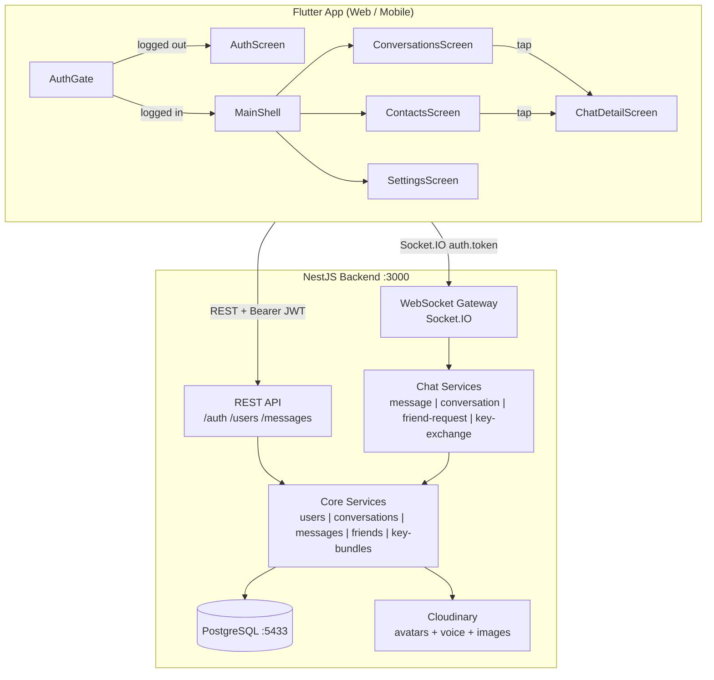
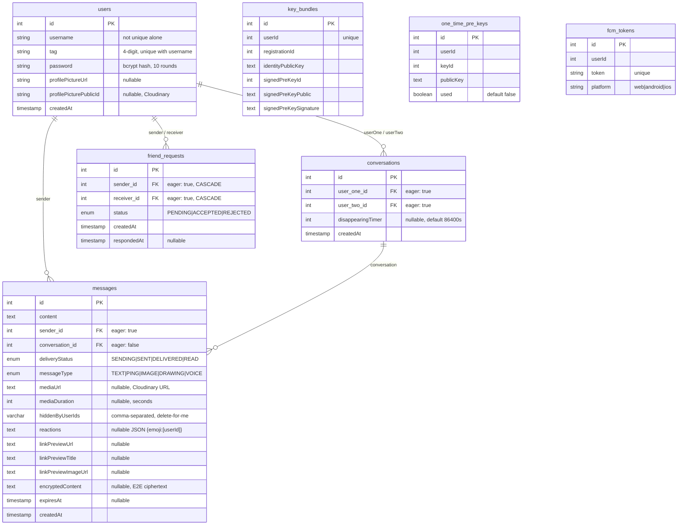

---
description:
alwaysApply: true
---

# CLAUDE.md — Fireplace

**Rules:**
- Always read this file before every code change
- Update this file after every code change
- Single source of truth for agents — if CLAUDE.md says X, X is correct
- All code in English (vars, functions, comments, commits). Polish OK in .md files only

---

## 0. Quick Start

```bash
# Terminal 1: Backend + DB (auto hot-reload)
docker-compose up

# Terminal 2: Flutter web (press 'r' for hot-reload)
cd frontend && flutter run -d chrome
```

**Before start:** Kill stale node processes: `taskkill //F //IM node.exe`

**Ports:** Backend :3000 | Frontend :random (check terminal) | DB :5433 (host) -> :5432 (container)

**Stack:** NestJS 11 + Flutter 3.x + PostgreSQL 16 + Socket.IO 4 + JWT + Cloudinary

**Phone (same WiFi):** `cd frontend && .\run_web_for_phone.ps1` or `flutter run -d web-server --web-hostname 0.0.0.0 --web-port 8080 --dart-define=BASE_URL=http://YOUR_PC_IP:3000`

**Tests:** `cd backend && npm test` (80 unit tests, 10 suites, no DB required)

---

## 1. Critical Rules & Gotchas

### TypeORM
- Always `relations: ['sender', 'receiver']` on friendRequestRepository queries — without: empty objects/crash
- Use find-then-remove for friend_requests delete — `.delete()` can't use nested relation conditions
- Always `new Date(val).getTime()` for expiresAt comparisons — TypeORM returns string or Date
- `deliveryStatus` never downgrades — enforced via `DELIVERY_STATUS_ORDER` map
- `synchronize: true` — column additions auto-apply on restart. No migrations

### Frontend
- Use `showTopSnackBar()` — ScaffoldMessenger covers chat input bar
- `enableForceNew()` on Socket.IO reconnect — Dart caches socket by URL, old JWT reused
- Provider can't call Navigator — use `consumePendingOpen()` / `consumeFriendRequestSent()` patterns
- Guard `Platform` with `!kIsWeb` — `dart:io` crashes on web
- `copyWith` must include ALL fields — missing field = data silently lost
- Voice recording: mic must stay in widget tree — GestureDetector unmounts -> no events
- Timer via `ValueNotifier<int>` — overlay rebuilds freeze timer
- `clearStatus()` in AuthProvider appears unused but is called from auth_screen.dart — DO NOT DELETE
- Always run `flutter analyze` before deleting "unused" methods
- Multiple backends: if weird data, kill local `node.exe`, use Docker only

### Backend
- mediaUrl must be Cloudinary URL when provided — prevents SSRF; validated via `@Matches` regex
- Delete account cascade: key bundles -> OTPs -> msgs -> convs -> friend_reqs -> user (no cascade on User entity)
- `conversationsService.delete()` deletes msgs first (no cascade)
- Chat services: critical failures stop execution; non-critical (emit lists) log and continue
- Skip server-side link preview when `encryptedContent` present (server can't read content)

### E2E Encryption
- `EncryptionService.decrypt()` returns `Future` — must use async patterns
- Message history decrypts async: renders immediately, then decrypts in-place with `notifyListeners()`
- Own messages skip decryption (sender has plaintext from optimistic display)
- Conversation list shows "Encrypted message" for encrypted lastMessage (not decrypted at list level)
- Session establishment uses Completer with 10s timeout — on failure, message marked as failed (no unencrypted fallback)
- Keys NOT cleared on logout (persist for re-login). Only cleared on account deletion via `clearEncryptionKeys()`

---

## 2. Architecture Overview



**State Management:** 3 providers (ChangeNotifier): `AuthProvider` (login/logout/token/user), `ChatProvider` (conversations/messages/friends/socket/encryption), `SettingsProvider` (themeMode: light/dark/blue). Services: `SocketService` (Socket.IO), `ApiService` (REST), `EncryptionService` (Signal Protocol), `LinkPreviewService` (OG metadata).

**Backend services:** `ChatGateway` (18 handlers) delegates to `ChatMessageService`, `ChatConversationService`, `ChatFriendRequestService`, `ChatKeyExchangeService`. REST: `AuthController`, `UsersController`, `MessagesController`. Mappers: `UserMapper`, `MessageMapper`, `ConversationMapper`, `FriendRequestMapper` — all have `toPayload()`.

**DTO validation:** `chat/utils/dto.validator.ts` — runtime validation via `class-transformer` + `class-validator`. DTOs in `chat/dto/`.

---

## 3. File Location Map

### Backend (`backend/src/`)

| Domain | Key Files |
|---|---|
| **Auth** | `auth/auth.service.ts`, `auth/auth.controller.ts`, `auth/jwt-auth.guard.ts`, `auth/jwt.strategy.ts`, `auth/password.constants.ts` |
| **Users** | `users/user.entity.ts`, `users/users.service.ts`, `users/users.controller.ts` |
| **Conversations** | `conversations/conversation.entity.ts`, `conversations/conversations.service.ts` |
| **Messages** | `messages/message.entity.ts`, `messages/message.mapper.ts`, `messages/messages.service.ts`, `messages/messages.controller.ts` |
| **Friends** | `friends/friend-request.entity.ts`, `friends/friends.service.ts` |
| **Chat** | `chat/chat.gateway.ts`, `chat/services/chat-{message,conversation,friend-request,key-exchange}.service.ts` |
| **DTOs** | `chat/dto/chat.dto.ts` (main) + `chat/dto/{send-ping,clear-chat-history,set-disappearing-timer,delete-conversation-only,delete-message,upload-key-bundle,upload-one-time-pre-keys,fetch-pre-key-bundle}.dto.ts` |
| **Key Bundles** | `key-bundles/key-bundle.entity.ts`, `key-bundles/one-time-pre-key.entity.ts`, `key-bundles/key-bundles.service.ts` |
| **Mappers** | `chat/mappers/{conversation,user,friend-request}.mapper.ts`, `messages/message.mapper.ts` |
| **FCM/Push** | `fcm-tokens/fcm-token.entity.ts`, `fcm-tokens/fcm-tokens.service.ts`, `push-notifications/push-notifications.service.ts` |
| **Utils** | `chat/utils/dto.validator.ts`, `chat/services/link-preview.service.ts`, `cloudinary/cloudinary.service.ts`, `app.module.ts` |

### Frontend (`frontend/lib/`)

| Domain | Key Files |
|---|---|
| **Entry** | `main.dart`, `config/app_config.dart`, `constants/app_constants.dart` |
| **Models** | `models/{user,conversation,message,friend_request}_model.dart` |
| **Providers** | `providers/{auth,chat,settings}_provider.dart`, `providers/chat_reconnect_manager.dart`, `providers/conversation_helpers.dart` |
| **Services** | `services/{socket_service,api_service,encryption_service,link_preview_service,push_service}.dart` |
| **Encryption** | `services/encryption/signal_stores.dart` (4 persistent Signal stores) |
| **Screens** | `screens/{auth,main_shell,conversations,contacts,settings,chat_detail,add_or_invitations,privacy_safety}_screen.dart` |
| **Widgets** | `widgets/{chat_input_bar,chat_action_tiles,chat_message_bubble,voice_message_bubble,conversation_tile,top_snackbar,avatar_circle}.dart` |
| **Theme** | `theme/rpg_theme.dart` (`FireplaceColors` ThemeExtension) |
| **Push** | `services/push_service.dart`, `firebase_options.dart` |

---

## 4. Database Schema



**Constraints:** `users` unique on `(username, tag)` — Discord-style `username#tag`. No cascade on User entity — `deleteAccount()` manually cleans dependents.

---

## 5. How-To: Adding New Features

### Add a new WebSocket event:
1. Define DTO in `chat/dto/` with class-validator decorators
2. Add handler in `chat/services/chat-*.service.ts`
3. Add `@SubscribeMessage` in `chat/chat.gateway.ts` -> delegate to service
4. Add emit + listener in `services/socket_service.dart`
5. Pass handler from `ChatProvider.connect()`, handle state + `notifyListeners()`

### Add a new REST endpoint:
1. Add method in `*.service.ts`, route in `*.controller.ts` with `@UseGuards(JwtAuthGuard)`
2. Add API call in `services/api_service.dart`, call from provider/screen

### Add a new DB column:
1. Add to `*.entity.ts` (@Column) -> restart backend (auto-sync)
2. Update mapper if WebSocket payload, update frontend model (constructor, `fromJson()`, `copyWith()`)

---

## 6. WebSocket API

**Connection:** `io(baseUrl, { auth: { token: JWT } })` — token in auth only (not query). Gateway verifies JWT, tracks `onlineUsers: Map<userId, socketId>`.

### Message Events

| Client Emit | Server Emit (caller) | Server Emit (recipient) |
|---|---|---|
| `sendMessage` | `messageSent` | `newMessage` |
| `getMessages` | `messageHistory` | -- |
| `sendPing` | `pingSent` | `newPing` |
| `messageDelivered` | -- | `messageDelivered` (to sender) |
| `markConversationRead` | -- | `messageDelivered` (READ) per msg |
| `clearChatHistory` | `chatHistoryCleared` | `chatHistoryCleared` |
| `deleteMessage` | `messageDeleted` | `messageDeleted` (for_everyone only) |
| `addReaction` / `removeReaction` | `reactionUpdated` | `reactionUpdated` |
| -- (async) | `linkPreviewReady` | `linkPreviewReady` |

### Conversation Events

| Client Emit | Server Emit (caller) | Server Emit (other) |
|---|---|---|
| `startConversation` | `conversationsList` + `openConversation` | -- |
| `getConversations` | `conversationsList` | -- |
| `deleteConversationOnly` | `conversationDeleted` + `conversationsList` | same |
| `setDisappearingTimer` | `disappearingTimerUpdated` | `disappearingTimerUpdated` |

### Friend Events

| Client Emit | Server Emit (caller) | Server Emit (other) |
|---|---|---|
| `searchUsers` | `searchUsersResult` | -- |
| `sendFriendRequest` | `friendRequestSent` OR auto-accept | `newFriendRequest` OR auto-accept |
| `acceptFriendRequest` | `friendRequestAccepted` + lists + `openConversation` | same |
| `rejectFriendRequest` | `friendRequestRejected` + `friendRequestsList` | -- |
| `getFriendRequests` | `friendRequestsList` + `pendingRequestsCount` | -- |
| `getFriends` | `friendsList` | -- |
| `unfriend` | `unfriended` + `conversationsList` + `friendsList` | same |
| `blockUser` | `blockedList` | `youWereBlocked` |
| `unblockUser` | `blockedList` | -- |
| `getBlockedList` | `blockedList` | -- |

### E2E Key Exchange Events

| Client Emit | Server Emit (caller) | Server Emit (target) |
|---|---|---|
| `uploadKeyBundle` | `keyBundleUploaded` | -- |
| `uploadOneTimePreKeys` | `oneTimePreKeysUploaded` | -- |
| `fetchPreKeyBundle` | `preKeyBundleResponse` | `preKeysLow` (when < 10) |

---

## 7. REST API

| Method | Path | Auth | Body / Params | Response |
|---|---|---|---|---|
| POST | `/auth/register` | -- | `{ username, password }` | `{ id, username, tag }` |
| POST | `/auth/login` | -- | `{ identifier, password }` | `{ access_token }` |
| POST | `/users/profile-picture` | JWT | multipart `file` (JPEG/PNG, 5MB) | `{ profilePictureUrl }` |
| POST | `/users/reset-password` | JWT | `{ oldPassword, newPassword }` | 200 |
| DELETE | `/users/account` | JWT | `{ password }` | 200 |
| POST | `/messages/voice` | JWT | multipart `audio` (10MB) + `duration` + `expiresIn?` | `{ mediaUrl, publicId, duration }` |
| POST | `/messages/image` | JWT | multipart `file` (5MB) + `recipientId` + `expiresIn?` | MessagePayload |

**Password:** 8+ chars, 1 uppercase, 1 lowercase, 1 number. **Login:** username or `username#tag`. **JWT:** `{ sub: userId, username, tag, profilePictureUrl }`. **Rate limits:** Login 5/15min, Register 3/h, Image 10/min, Voice 10/60s.

---

## 8. Key Features & Behaviors

### State Management (ChatProvider)

**Connect flow:** cancel reconnect -> clear ALL state -> dispose old socket + create new with `enableForceNew()` -> on connect: fetch conversations/friendRequests/friends + register listeners -> delayed re-fetch 500ms if empty.

**Optimistic messaging:** Create temp message (id=-timestamp, SENDING, tempId) -> `notifyListeners` -> encrypt async -> emit `sendMessage` -> backend returns `messageSent` with tempId -> replace temp with real.

**Blocking state:** `_blockedUsers` = blocked **by me**. `_blockedByUserIds` (Set) = users who blocked **me** (from `youWereBlocked` push). On `youWereBlocked`: add to set, remove from friends, remove conversations, clear active chat.

**Reconnection:** `ChatReconnectManager`: exponential backoff capped at 30s, max 5 attempts, only when `intentionalDisconnect == false`.

**Key patterns:** `consumePendingOpen()` (backend emits `openConversation` -> provider stores ID -> screen consumes + navigates). `consumeFriendRequestSent()` (same for friend request -> snackbar + pop).

### E2E Encryption (Signal Protocol)

`libsignal_protocol_dart` v0.7.4 + `flutter_secure_storage`. **Text messages only** — media not yet encrypted. X3DH key agreement -> Double Ratchet. Single-device (deviceId=1). TOFU verification.

**Send:** content -> `LinkPreviewService.fetchPreview()` -> build envelope -> `_ensureSession(recipientId)` (Completer-based pre-key fetch) -> `encrypt()` -> emit with `encryptedContent`. **Receive:** if `encryptedContent` present, decrypt async + parse envelope + update in-place. **No fallback:** if E2E not ready or encryption fails, message is marked as failed (no unencrypted sending).

**Ciphertext format:** `"{type}:{base64}"` (type 3 = PreKeySignalMessage, type 1 = SignalMessage). Server stores in `encryptedContent`, stores `"[encrypted]"` as `content` placeholder.

**Keys:** 100 one-time pre-keys per batch. `preKeysLow` when < 10 -> auto-replenish. Backend: zero-knowledge pass-through (stores public material only).

### Username#Tag (Discord-style)

4-digit tag (1000-9999), random at registration. **Username is unique** (case-insensitive). Display: Settings shows `username#tag`, Contacts/Conversations/chat header show username only. Tap avatar in chat -> reveals `username#tag` for 5s (tag in accent color). Login: username or `username#tag`.

### Disappearing Messages

Three-layer: (1) Frontend `removeExpiredMessages()` every 1s, (2) Backend filters on `getMessages`, (3) Cloudinary TTL. Default 86400s (1 day). `null` = disabled. Timer starts on DELIVERY.

### Voice Messages

Hold-to-record mic, drag to trash to cancel. Optimistic UI -> POST /messages/voice -> Cloudinary -> WebSocket. Playback: cached at `audio_cache/`, scrubbable waveform, speed 1x/1.5x/2x. Format: AAC/M4A (native), WAV (web).

### Delete Actions

| Action | Deletes | Friend? | Event |
|---|---|---|---|
| Delete Conversation (swipe) | Messages + Conversation | Kept | `deleteConversationOnly` |
| Unfriend (long-press contacts) | FriendRequest + Conv + Messages | Removed | `unfriend` |
| Clear History (action tile) | Messages only | Kept | `clearChatHistory` |
| Delete for me (long-press msg) | Hidden for current user | Kept | `deleteMessage` mode=for_me |
| Delete for everyone (own msg) | Hard-deleted for both | Kept | `deleteMessage` mode=for_everyone |

### Other Features

- **Reactions:** Long-press message -> 6 emoji picker. Max 1 per user. `reactions` column (JSON). `addReaction`/`removeReaction` events.
- **Typing indicators:** 300ms debounce, 3s auto-clear. Backend relay only (no DB). `typing` -> `partnerTyping`.
- **Unread badge:** Backend `countUnreadForRecipient()`. Frontend `_unreadCounts` map.
- **Link preview:** Client-side OG fetch before encryption. Stored in `linkPreview*` columns. `linkPreviewReady` event for unencrypted.
- **Image messages:** POST /messages/image. Verifies friend relationship. `messageType=IMAGE`.
- **Ping:** Empty content, `messageType=PING`. Uses conversation's `disappearingTimer`.
- **Push (FCM):** Silent payload (no content). Gracefully disabled without `FIREBASE_SERVICE_ACCOUNT`. Firebase config in gitignored `firebase_secrets.dart` / `firebase-config.js`.
- **3 themes:** Light, Dark (Wire-style gray), Blue (red-blue accent). `FireplaceColors` ThemeExtension.
- **Friend auto-accept:** If B has pending request to A when A sends to B -> auto-accept, create conversation, emit `openConversation`.

---

## 9. Frontend Screens & Widgets

**Navigation:** AuthGate -> AuthScreen (login/register) OR MainShell (IndexedStack: Conversations, Contacts, Settings). Desktop >600px: sidebar+detail layout.

**Key screens:** AuthScreen (`clearStatus()` on tab switch — DO NOT DELETE), ConversationsScreen (swipe-to-delete, `consumePendingOpen()`), ChatDetailScreen (Timer.periodic 1s for expired msgs, `markConversationRead` on open), AddOrInvitationsScreen (searchUsers -> auto-send if 1 result, picker if multiple, `consumeFriendRequestSent()`), PrivacySafetyScreen (E2E info, identity fingerprint).

**Key widgets:** ChatInputBar (text+send+mic+action tiles), ChatActionTiles (Camera/Gallery/Ping/Timer/Clear/Drawing), ChatMessageBubble (all types, long-press -> reactions+delete), VoiceMessageBubble (waveform, speed toggle), ConversationTile (Dismissible, unread badge), TopSnackbar (never use ScaffoldMessenger), AvatarCircle.

**Models:** `UserModel` (`displayHandle` getter), `ConversationModel` (immutable), `MessageModel` (`copyWith` for status/content/media), `FriendRequestModel`. Frontend-only: `MessageDeliveryStatus.failed`.

---

## 10. Environment & Config

| Variable | Required | Purpose |
|---|---|---|
| `DB_HOST/PORT/USER/PASS/NAME` | Yes | PostgreSQL |
| `JWT_SECRET` | Yes | JWT signing (>=32 chars in prod) |
| `CLOUDINARY_CLOUD_NAME/API_KEY/API_SECRET` | Yes | Media storage |
| `FIREBASE_SERVICE_ACCOUNT` | No | FCM push (graceful if missing) |
| `ALLOWED_ORIGINS` | No | CORS (comma-separated, strict in prod) |
| `BASE_URL` | No | Frontend dart define, defaults to `http://{host}:3000` |

**Docker:** `db` postgres:16-alpine (5433->5432, postgres/postgres/chatdb), `backend` node:20-alpine (:3000). Frontend runs locally.

**Firebase setup:** Copy `.example` files -> fill values: `firebase_secrets.dart`, `firebase-config.js`, `FIREBASE_SERVICE_ACCOUNT` env var.

---

## 11. Known Limitations & Tech Debt

- E2E: text only (no media/voice/drawing encryption), no multi-device, no key recovery, conversation list shows "Encrypted message"
- No message edit, no fuzzy search, no iOS APNs
- No unique constraint on `(sender, receiver)` in friend_requests
- Pagination: simple limit/offset (default 50), N+1 in `_conversationsWithUnread()`
- Large files: `chat_provider.dart` (~750 lines), `chat-friend-request.service.ts` (~428 lines)
- Reply-to preview leaks content to server (should show "Encrypted message")
- Migration scripts in `backend/scripts/` (manual)

---

**Maintain this file.** After every code change, update the relevant section.
