# CLAUDE.md — MVP Chat App

**Rules:**
- Update this file after every code change
- Single source of truth for agents — if CLAUDE.md says X, X is correct
- All code in English (vars, functions, comments, commits). Polish OK in .md files only


---

## 0. Quick Start

```bash
# Terminal 1: Backend + DB (auto hot-reload via NestJS watch mode)
docker-compose up

# Terminal 2: Flutter web (manual hot-reload — press 'r' in terminal)
cd frontend && flutter run -d chrome
```

**Before start:** Kill stale node processes: `taskkill //F //IM node.exe`

**Ports:** Backend :3000, Frontend :random (check terminal), DB :5433 (host) -> :5432 (container)

**Stack:** NestJS 11 + Flutter 3.x + PostgreSQL 16 + Socket.IO 4 + JWT + Cloudinary

**Mobile (on hold):** Local network config issues. Will return later.

---

## 1. Architecture Overview

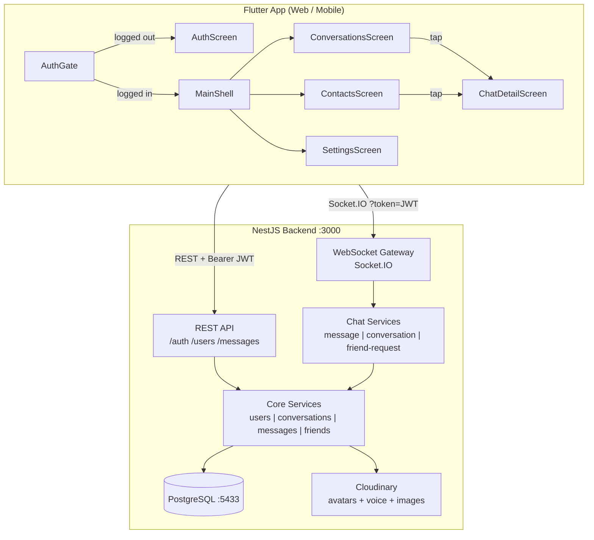

### State Management

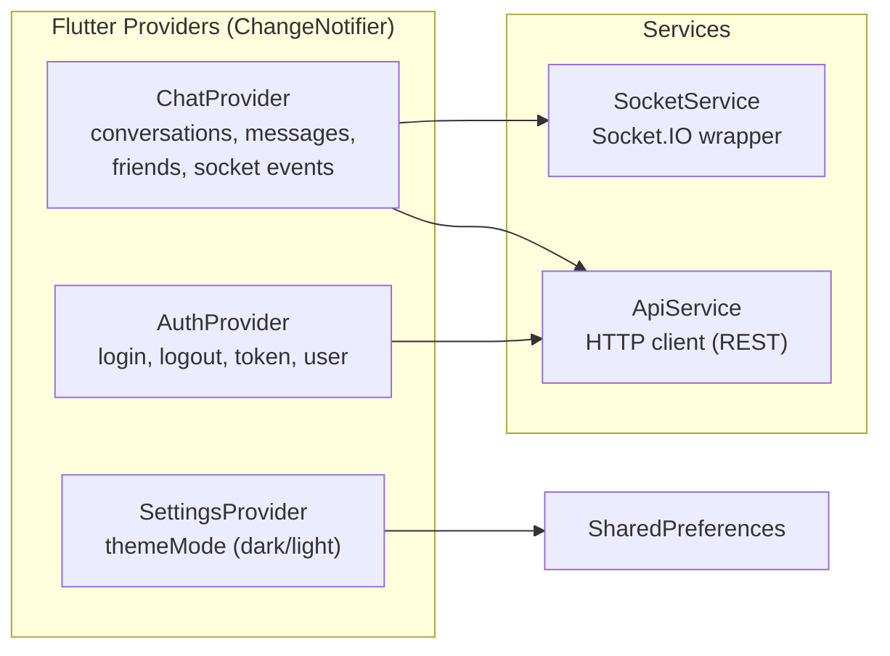

---

## 2. Database Schema

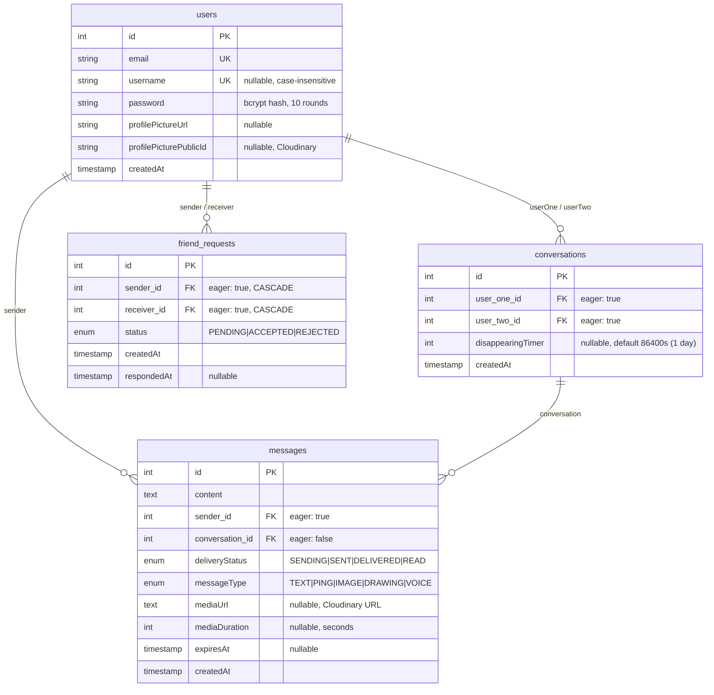

**TypeORM config:** `synchronize: true` -- column additions auto-apply on restart. No migrations.

**Key constraints:**
- `friend_requests`: index on `(sender, receiver)`
- No cascade on User entity -- `deleteAccount()` manually cleans dependents
- `conversations.delete()` must delete messages first (no cascade)

---

## 3. WebSocket API -- Complete Event Reference

**Connection:** `io(baseUrl, { query: { token: JWT }, auth: { token: JWT } })`
Gateway verifies JWT via `jwtService.verify()`, stores `client.data.user = { id, email, username }`, tracks `onlineUsers: Map<userId, socketId>`.

### 3.1 Message Events

| Client Emit | Server Emit (caller) | Server Emit (recipient) |
|---|---|---|
| `sendMessage` | `messageSent` | `newMessage` |
| `getMessages` | `messageHistory` (array) | -- |
| `sendPing` | `pingSent` | `newPing` |
| `messageDelivered` | -- | `messageDelivered` (to sender) |
| `markConversationRead` | -- | `messageDelivered` (READ) per msg |
| `clearChatHistory` | `chatHistoryCleared` | `chatHistoryCleared` |

### 3.2 Conversation Events

| Client Emit | Server Emit (caller) | Server Emit (other) |
|---|---|---|
| `startConversation` | `conversationsList` + `openConversation` | -- |
| `getConversations` | `conversationsList` | -- |
| `deleteConversationOnly` | `conversationDeleted` + `conversationsList` | same |
| `setDisappearingTimer` | `disappearingTimerUpdated` | `disappearingTimerUpdated` |

### 3.3 Friend Events

| Client Emit | Server Emit (caller) | Server Emit (other) |
|---|---|---|
| `sendFriendRequest` | `friendRequestSent` OR auto-accept flow | `newFriendRequest` OR auto-accept |
| `acceptFriendRequest` | `friendRequestAccepted` + lists + `openConversation` | same |
| `rejectFriendRequest` | `friendRequestRejected` + `friendRequestsList` | -- |
| `getFriendRequests` | `friendRequestsList` + `pendingRequestsCount` | -- |
| `getFriends` | `friendsList` | -- |
| `unfriend` | `unfriended` + `conversationsList` + `friendsList` | same |

### 3.4 Key Payloads

**Message payload** (`messageSent` / `newMessage` / `pingSent` / `newPing`):
```typescript
{
  id: number,
  content: string,
  senderId: number,
  senderEmail: string,
  senderUsername: string | null,
  conversationId: number,
  createdAt: string,             // ISO timestamp
  deliveryStatus: string,        // SENDING | SENT | DELIVERED | READ
  messageType: string,           // TEXT | PING | IMAGE | DRAWING | VOICE
  mediaUrl: string | null,       // Cloudinary URL
  mediaDuration: number | null,  // seconds (voice)
  expiresAt: string | null,      // ISO timestamp
  tempId: string | null,         // client-generated for optimistic matching
}
```

**Conversation payload** (`conversationsList` item):
```typescript
{
  id: number,
  userOne: { id, email, username, profilePictureUrl },
  userTwo: { id, email, username, profilePictureUrl },
  createdAt: string,
  disappearingTimer: number | null,  // seconds
  unreadCount: number,
  lastMessage: MessagePayload | null,
}
```

**Friend request payload:** `{ id, sender: UserPayload, receiver: UserPayload, status, createdAt, respondedAt }`

### 3.5 DTO Validation (class-validator)

| DTO | Fields | Notes |
|---|---|---|
| `SendMessageDto` | recipientId (int+), content (str 1-5000), expiresIn?, tempId?, messageType?, mediaUrl?, mediaDuration? | content validation skipped for VOICE/PING via `@ValidateIf` |
| `SendFriendRequestDto` | recipientEmail (str 5-255) | |
| `AcceptFriendRequestDto` | requestId (int+) | |
| `RejectFriendRequestDto` | requestId (int+) | |
| `GetMessagesDto` | conversationId (int+), limit?, offset? | |
| `StartConversationDto` | recipientEmail (str 5-255) | |
| `UnfriendDto` | userId (int+) | |
| `ClearChatHistoryDto` | conversationId (int+) | separate file |
| `SetDisappearingTimerDto` | conversationId (int+), seconds (int, nullable) | separate file |
| `DeleteConversationOnlyDto` | conversationId (int+) | separate file |
| `SendPingDto` | recipientId (int+) | separate file |

---

## 4. REST API

| Method | Path | Auth | Body / Params | Response |
|---|---|---|---|---|
| POST | `/auth/register` | -- | `{ email, password, username? }` | 201: `{ id, email, username }` |
| POST | `/auth/login` | -- | `{ email, password }` | 200: `{ access_token }` |
| POST | `/users/profile-picture` | JWT | multipart `file` (JPEG/PNG, max 5MB) | `{ profilePictureUrl }` |
| POST | `/users/reset-password` | JWT | `{ oldPassword, newPassword }` | 200 |
| DELETE | `/users/account` | JWT | `{ password }` | 200 (cascade deletes all data) |
| POST | `/messages/voice` | JWT | multipart `audio` (AAC/M4A/MP3/WebM/WAV, max 10MB) + `duration` + `expiresIn?` | `{ mediaUrl, publicId, duration }` |
| POST | `/messages/image` | JWT | multipart `file` (JPEG/PNG, max 5MB) + `recipientId` + `expiresIn?` | MessagePayload |

**Password rules:** 8+ chars, 1 uppercase, 1 lowercase, 1 number. Regex: `/^(?=.*[a-z])(?=.*[A-Z])(?=.*\d)[a-zA-Z\d\s@$!%*?&]{8,}$/`

**Rate limits:** Login 5/15min, Register 3/h, Image upload 10/min, Voice upload 10/60s.

**JWT payload:** `{ sub: userId, email, username, profilePictureUrl }`. Frontend decodes via `jwt_decoder` package.

---

## 5. Frontend -- Screen & Navigation Map

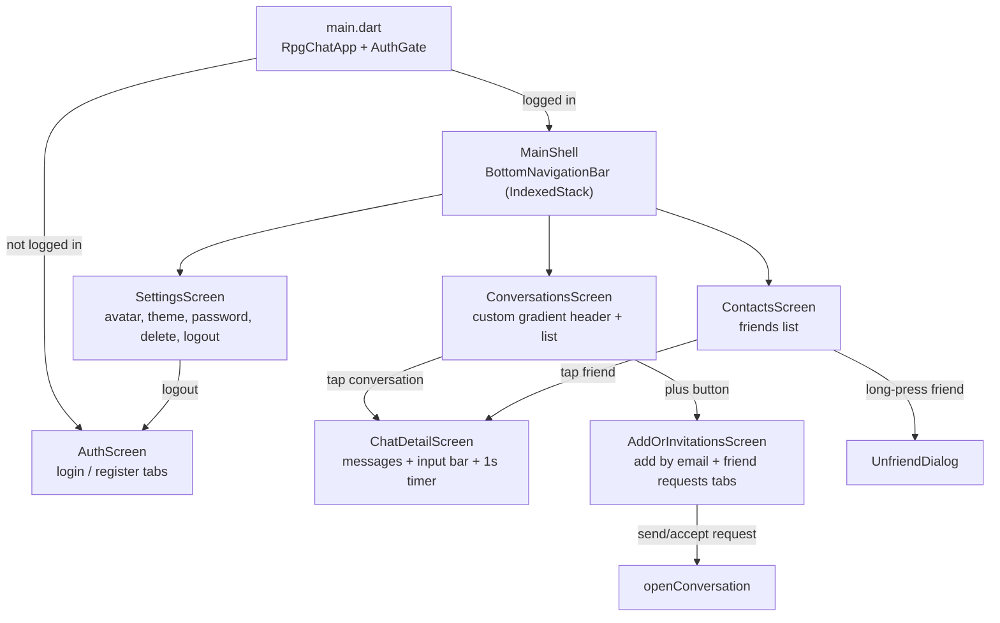

### 5.1 Screen Details

| Screen | File | Key Behavior |
|---|---|---|
| **AuthScreen** | `screens/auth_screen.dart` | Tabs: Login, Register. Uses `AuthProvider`. `clearStatus()` on tab switch. |
| **MainShell** | `screens/main_shell.dart` | `IndexedStack` with 3 tabs. Custom chat bubble icon (CustomPainter). Avatar tap -> settings. |
| **ConversationsScreen** | `screens/conversations_screen.dart` | Custom gradient header. `consumePendingOpen()` pattern. Swipe-to-delete (Dismissible). Desktop >600px: sidebar+detail. |
| **ContactsScreen** | `screens/contacts_screen.dart` | Friends list from `ChatProvider.friends`. Tap -> start conversation. Long-press -> unfriend dialog. |
| **SettingsScreen** | `screens/settings_screen.dart` | Avatar upload (image_picker), theme toggle, password reset, delete account, logout. |
| **ChatDetailScreen** | `screens/chat_detail_screen.dart` | Message list + ChatInputBar. Timer.periodic(1s) calls `removeExpiredMessages()`. `markConversationRead` on open. |
| **AddOrInvitationsScreen** | `screens/add_or_invitations_screen.dart` | Two tabs: `_AddByEmailTab`, `_FriendRequestsTab`. `consumeFriendRequestSent()` pattern. |

### 5.2 Widget Details

| Widget | File | Purpose |
|---|---|---|
| **ChatInputBar** | `widgets/chat_input_bar.dart` | Text input + send + mic (voice) + action tiles toggle. Telegram-style hold-to-record. |
| **ChatActionTiles** | `widgets/chat_action_tiles.dart` | Grid: Camera, Gallery, Ping, Timer, Clear History, Drawing. |
| **ChatMessageBubble** | `widgets/chat_message_bubble.dart` | Renders TEXT/PING/IMAGE/DRAWING/VOICE bubbles. Delivery status icons (own msgs only). |
| **VoiceMessageBubble** | `widgets/voice_message_bubble.dart` | Waveform (CustomPainter), play/pause, **scrubbable waveform** (tap/drag to seek, Telegram-style), speed toggle (1x/1.5x/2x via just_audio). Lazy download + caching. |
| **ConversationTile** | `widgets/conversation_tile.dart` | Dismissible swipe-to-delete. Avatar, name, last message preview, unread badge, timestamp. |
| **TopSnackbar** | `widgets/top_snackbar.dart` | All notifications at top of screen. Never use ScaffoldMessenger. |
| **AvatarCircle** | `widgets/avatar_circle.dart` | Profile picture with stable cache-bust (per profilePictureUrl, NOT DateTime.now()). |

### 5.3 Desktop Layout (>600px)

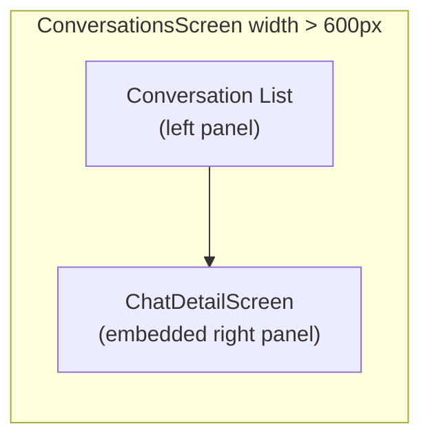

Breakpoint: `AppConstants.layoutBreakpointDesktop = 600`. Below = stacked navigation (push/pop).

---

## 6. Frontend -- State Management Deep Dive

### 6.1 ChatProvider (central hub)

**File:** `providers/chat_provider.dart` (~793 lines)

**Internal state:**

| Field | Type | Purpose |
|---|---|---|
| `_conversations` | `List<ConversationModel>` | All user's conversations |
| `_messages` | `List<MessageModel>` | Messages for active conversation only |
| `_activeConversationId` | `int?` | Currently viewed conversation |
| `_currentUserId` | `int?` | Logged-in user ID |
| `_lastMessages` | `Map<int, MessageModel>` | Last message per conversation (list preview) |
| `_unreadCounts` | `Map<int, int>` | Unread count per conversation |
| `_friends` | `List<UserModel>` | Friend list |
| `_friendRequests` | `List<FriendRequestModel>` | Pending incoming friend requests |
| `_pendingOpenConversationId` | `int?` | consumePendingOpen pattern |
| `_friendRequestJustSent` | `bool` | consumeFriendRequestSent pattern |
| `_showPingEffect` | `bool` | Triggers ping animation |
| `_tokenForReconnect` | `String?` | JWT stored for reconnection |
| `_reconnectAttempts` | `int` | Current reconnect attempt count (max 5) |
| `_intentionalDisconnect` | `bool` | Prevents reconnect on intentional logout |

**Connect flow:**
1. Cancel pending reconnect timer, set `_intentionalDisconnect = false`
2. Clear ALL state (prevents data leakage between users)
3. Dispose old socket, create new with `enableForceNew()`
4. On connect: fetch conversations, friend requests, friends
5. Register 22 event listeners on socket
6. Delayed re-fetch after 500ms if conversations empty (handles slow initial response)

**Optimistic messaging flow:**
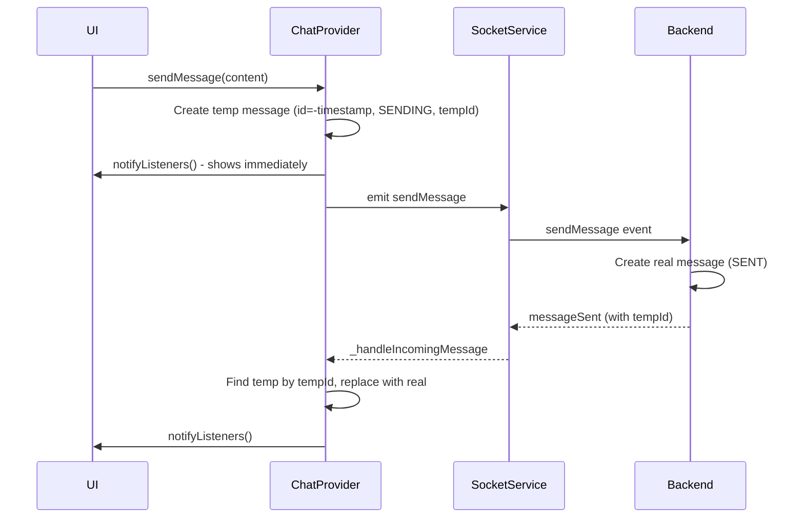

**Reconnection:** Exponential backoff: `initialDelay * 2^(attempt-1)`, capped at 30s. Max 5 attempts. Only when `_intentionalDisconnect == false` and token exists.

### 6.2 Key Provider Patterns

**consumePendingOpen (Provider -> Navigator bridge):**
```
Backend emits openConversation { conversationId }
  -> ChatProvider sets _pendingOpenConversationId, notifyListeners()
  -> Screen in build() calls consumePendingOpen() -> returns id, clears it
  -> If id != null: addPostFrameCallback -> Navigator.pop(context, id)
```
Used in: AddOrInvitationsScreen, ConversationsScreen.

**consumeFriendRequestSent:**
```
Backend emits friendRequestSent
  -> ChatProvider sets _friendRequestJustSent = true
  -> Screen calls consumeFriendRequestSent() -> returns true, resets flag
  -> Shows snackbar + Navigator.pop
```

### 6.3 AuthProvider

**File:** `providers/auth_provider.dart` (~152 lines)

- On construction: loads saved JWT from SharedPreferences, decodes user via `JwtDecoder`
- `login()`: POST /auth/login -> decode JWT -> save to SharedPreferences (`jwt_token`)
- `logout()`: clear token + user, remove `jwt_token` from prefs (keeps dark mode pref)
- `updateProfilePicture()`: upload via ApiService, update local user model via `copyWith`
- `resetPassword()`, `deleteAccount()`: delegate to ApiService
- `clearStatus()`: clear status message (used by AuthScreen on tab switch -- DO NOT DELETE)

### 6.4 SettingsProvider

Manages `themeMode` (dark/light/system). Persisted in SharedPreferences as `isDarkMode`.

### 6.5 Frontend Models

| Model | File | Fields | Notes |
|---|---|---|---|
| `UserModel` | `models/user_model.dart` | id, email, username?, profilePictureUrl? | `copyWith()` for all fields |
| `ConversationModel` | `models/conversation_model.dart` | id, userOne, userTwo, createdAt, disappearingTimer? | Immutable |
| `MessageModel` | `models/message_model.dart` | id, content, senderId, senderEmail, senderUsername?, conversationId, createdAt, deliveryStatus, expiresAt?, messageType, mediaUrl?, mediaDuration?, tempId? | `copyWith()` for deliveryStatus, expiresAt, mediaUrl, mediaDuration |
| `FriendRequestModel` | `models/friend_request_model.dart` | id, sender, receiver, status, createdAt, respondedAt? | |

**Enums (frontend):** `MessageDeliveryStatus` (sending, sent, delivered, read, **failed**), `MessageType` (text, ping, image, drawing, voice). Note: frontend adds `failed` status not present in backend enum.

---

## 7. Backend -- Service Architecture

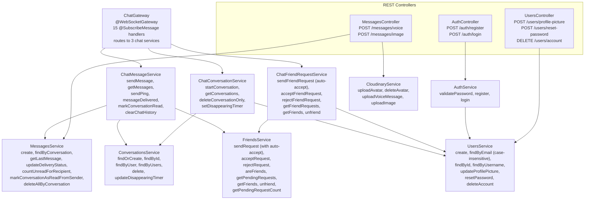

### 7.1 Delivery Status State Machine

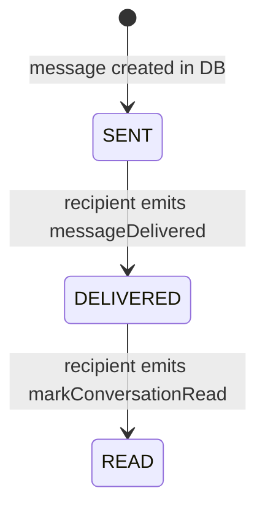

Status order enforced via `DELIVERY_STATUS_ORDER` map in `MessagesService.updateDeliveryStatus()` -- never downgrades (READ cannot become DELIVERED even if events arrive out of order).

### 7.2 Friend Request -- Auto-Accept (Mutual Requests)

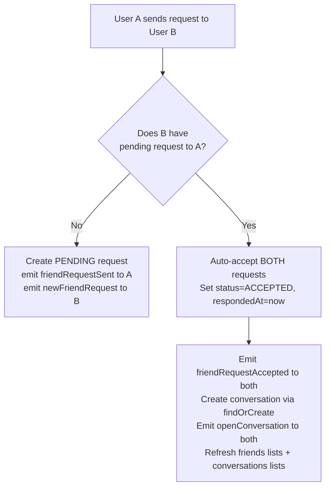

### 7.3 Delete Account Cascade

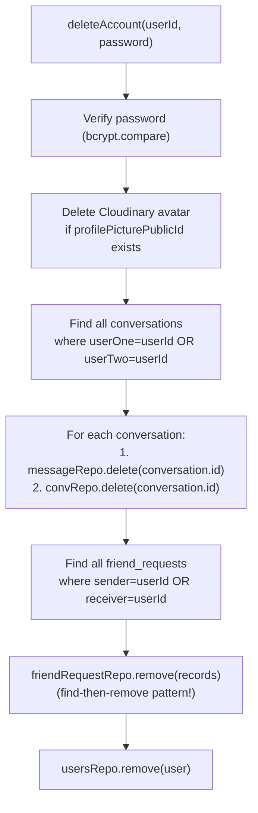

### 7.4 Mappers (WebSocket payload builders)

| Mapper | File | Method | Converts |
|---|---|---|---|
| `UserMapper` | `chat/mappers/user.mapper.ts` | `toPayload(user)` | User -> `{ id, email, username, profilePictureUrl }` |
| `ConversationMapper` | `chat/mappers/conversation.mapper.ts` | `toPayload(conv, options?)` | Conversation -> payload with optional unreadCount + lastMessage |
| `FriendRequestMapper` | `chat/mappers/friend-request.mapper.ts` | `toPayload(request)` | FriendRequest -> payload with sender/receiver as UserPayload |

### 7.5 DTO Validation Utility

`chat/utils/dto.validator.ts` -- Runtime validation using `class-transformer` (plainToInstance) + `class-validator` (validateSync). Used by all chat service handlers before processing data.

---

## 8. Feature Details

### 8.1 Disappearing Messages

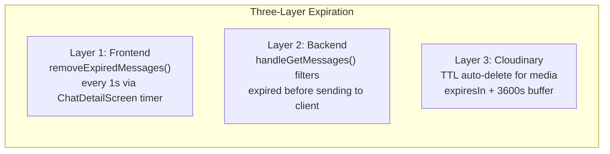

**Config:** `conversations.disappearingTimer` (default 86400s = 1 day). Set via `setDisappearingTimer` event. `null` = disabled.

**Timer starts on DELIVERY, not send** (Telegram/Signal behavior).

**Backend handleGetMessages filter:**
```typescript
// TypeORM may return expiresAt as string or Date -- direct comparison yields NaN
const nowMs = Date.now();
const active = messages.filter(
  (m) => !m.expiresAt || new Date(m.expiresAt as any).getTime() > nowMs,
);
```

**Frontend removeExpiredMessages:** Removes from both `_messages` AND `_lastMessages` maps.

### 8.2 Voice Messages (Telegram-style)

**Recording flow in ChatInputBar:**
1. Long-press mic -> recording starts via `record` package
2. **Mic on press:** turns red + scales up (1.15x, AnimatedScale)
3. Timer shown via `ValueNotifier<int>` (prevents rebuild freeze)
4. **Drag to trash:** User must drag mic icon to trash to cancel; trash "opens" (scales 1.25x) when mic gets close (60px); cancel only on release when mic is over trash zone (50% of screen width)
5. **Release outside trash** -> `_stopRecording()` -> upload + send
6. **Release over trash** -> `_cancelRecording()`; trash zone = `_cancelDragOffset < -screenWidth*0.5`
7. **Mic stays visible** during recording; only mic slides (recording bar with red dot, timer stays fixed)
8. `Transform.translate` moves mic icon with finger drag (global position tracking)

**Upload flow:**
1. Create optimistic message (SENDING status, negative temp ID)
2. POST /messages/voice -> Cloudinary (`resource_type: 'video'`, folder `voice-messages/`)
3. On success: send via WebSocket with `mediaUrl` + `mediaDuration`, delete temp file (native)
4. On failure: mark as FAILED -> retry button (native only, web has no cached bytes)

**Playback:** Lazy download from `mediaUrl`, cached at `{appDocDir}/audio_cache/{messageId}.m4a`. **Scrubbable waveform** (Telegram-style): tap or drag on waveform to seek; no separate slider. Speed toggle (1x/1.5x/2x via `just_audio`).

**Format:** AAC/M4A (native), WAV (web). 44.1kHz mono. Max 2 min, min 1s.

**Platform guard:** `permission_handler` on mobile only (`!kIsWeb`). Web: browser handles mic permission.

### 8.3 Delete Conversation vs Unfriend

| Action | Trigger | What's Deleted | Friend Preserved? | Event |
|---|---|---|---|---|
| **Delete Conversation** | Swipe on ConversationsScreen | Messages + Conversation | Yes | `deleteConversationOnly` |
| **Unfriend** | Long-press on ContactsScreen | FriendRequest + Conversation + Messages | No | `unfriend` |
| **Clear Chat History** | Action tile in ChatDetailScreen | Messages only | Yes (conv too) | `clearChatHistory` |

### 8.4 Unread Badge

- Backend: `countUnreadForRecipient()` uses QueryBuilder: sender != user AND status != READ AND not expired
- `conversationsList` includes `unreadCount` per conversation
- Frontend: `_unreadCounts` map, incremented on `newMessage` when chat not active, cleared on `openConversation`

### 8.5 Ping Messages

One-shot notification. Empty content, `messageType=PING`. Uses conversation's `disappearingTimer` for expiration. Both `pingSent` and `newPing` handled by same `_handlePingReceived()`.

### 8.6 Image Messages

Upload via REST: POST /messages/image (multipart, JPEG/PNG, max 5MB). Creates message in DB with `messageType=IMAGE` + `mediaUrl`. Verifies friend relationship. Supports disappearing timer via `expiresIn` param.

---

## 9. File Location Map

### Backend (NestJS) -- `backend/src/`

| Domain | Files |
|---|---|
| **Auth** | `auth/auth.service.ts`, `auth/auth.controller.ts`, `auth/jwt-auth.guard.ts`, `auth/jwt.strategy.ts` |
| **Users** | `users/user.entity.ts`, `users/users.service.ts`, `users/users.controller.ts` |
| **Conversations** | `conversations/conversation.entity.ts`, `conversations/conversations.service.ts` |
| **Messages** | `messages/message.entity.ts`, `messages/messages.service.ts`, `messages/messages.controller.ts` |
| **Friends** | `friends/friend-request.entity.ts`, `friends/friends.service.ts` |
| **WebSocket gateway** | `chat/chat.gateway.ts` (router only, delegates to services) |
| **Chat services** | `chat/services/chat-message.service.ts`, `chat/services/chat-conversation.service.ts`, `chat/services/chat-friend-request.service.ts` |
| **DTOs** | `chat/dto/chat.dto.ts` (main), `chat/dto/send-ping.dto.ts`, `chat/dto/clear-chat-history.dto.ts`, `chat/dto/set-disappearing-timer.dto.ts`, `chat/dto/delete-conversation-only.dto.ts` |
| **Mappers** | `chat/mappers/conversation.mapper.ts`, `chat/mappers/user.mapper.ts`, `chat/mappers/friend-request.mapper.ts` |
| **Utils** | `chat/utils/dto.validator.ts` |
| **Cloudinary** | `cloudinary/cloudinary.service.ts`, `cloudinary/cloudinary.module.ts` |
| **App config** | `app.module.ts` (TypeORM, Throttler, JWT, Cloudinary, Schedule) |

### Frontend (Flutter) -- `frontend/lib/`

| Domain | Files |
|---|---|
| **Entry + config** | `main.dart`, `config/app_config.dart`, `constants/app_constants.dart` |
| **Models** | `models/user_model.dart`, `models/conversation_model.dart`, `models/message_model.dart`, `models/friend_request_model.dart` |
| **Providers** | `providers/auth_provider.dart`, `providers/chat_provider.dart`, `providers/settings_provider.dart` |
| **Services** | `services/socket_service.dart` (22 event callbacks), `services/api_service.dart` (REST client) |
| **Screens** | `screens/auth_screen.dart`, `screens/main_shell.dart`, `screens/conversations_screen.dart`, `screens/contacts_screen.dart`, `screens/settings_screen.dart`, `screens/chat_detail_screen.dart`, `screens/add_or_invitations_screen.dart` |
| **Widgets** | `widgets/chat_input_bar.dart`, `widgets/chat_action_tiles.dart`, `widgets/chat_message_bubble.dart`, `widgets/voice_message_bubble.dart`, `widgets/conversation_tile.dart`, `widgets/top_snackbar.dart`, `widgets/avatar_circle.dart` |
| **Theme** | `theme/rpg_theme.dart` (themeData dark + themeDataLight) |

---

## 10. How-To: Adding New Features

### Add a new WebSocket event:
1. Define DTO in `chat/dto/` with class-validator decorators
2. Export from `chat/dto/chat.dto.ts` (or create separate file + export)
3. Add handler method in appropriate `chat/services/chat-*.service.ts`
4. Add `@SubscribeMessage('eventName')` in `chat/chat.gateway.ts` -> delegate to service
5. Add emit method in `frontend/lib/services/socket_service.dart`
6. Add callback param to `SocketService.connect()` and register listener
7. Pass handler from `ChatProvider.connect()` to socket service
8. Handle state update + `notifyListeners()` in `ChatProvider`

### Add a new REST endpoint:
1. Add method in `*.service.ts` (business logic)
2. Add route in `*.controller.ts` with `@UseGuards(JwtAuthGuard)` if auth needed
3. Add API call in `frontend/lib/services/api_service.dart`
4. Call from provider or screen

### Add a new DB column:
1. Add to `*.entity.ts` (with @Column decorator)
2. Restart backend (TypeORM `synchronize: true` auto-applies)
3. Update mapper in `chat/mappers/*.mapper.ts` if it touches WebSocket payloads
4. Update frontend model (`models/*.dart`): constructor, `fromJson()`, `copyWith()`
5. Update all places that create/use the model

---

## 11. Critical Rules & Gotchas

### TypeORM

| Rule | Reason |
|---|---|
| Always `relations: ['sender', 'receiver']` on `friendRequestRepository` queries | Without: eager-loaded fields return empty objects or crash |
| Use find-then-remove for `friend_requests` delete | `.delete()` cannot use nested relation conditions like `sender: { id }` |
| Always `new Date(val).getTime()` for `expiresAt` comparisons | TypeORM returns string or Date from pg -- `string > Date` yields NaN |
| `messageRepo.delete({ conversation: { id } })` is OK | Single-relation delete works fine |
| `deliveryStatus` never downgrades | Enforced in `updateDeliveryStatus()` via `DELIVERY_STATUS_ORDER` map |

### Frontend

| Rule | Reason |
|---|---|
| Use `showTopSnackBar()` for notifications | `ScaffoldMessenger.showSnackBar` covers the chat input bar |
| `enableForceNew()` on Socket.IO reconnect | Without it, Dart caches socket by URL -- old JWT used after re-login |
| Provider can't call Navigator | Use `consumePendingOpen()` / `consumeFriendRequestSent()` patterns |
| Guard `Platform` with `!kIsWeb` | `dart:io` Platform crashes on web -- use `kIsWeb` from `foundation.dart` |
| `copyWith` must include ALL fields | Missing field in copyWith -> data silently lost on state update |
| Voice recording: mic must stay in widget tree | If mic hidden during recording, GestureDetector unmounts -> no release/drag events |
| Timer via `ValueNotifier<int>` | Overlay rebuilds freeze timer -- use ValueListenableBuilder for isolation |
| Multiple backends issue | If frontend shows weird data: kill local `node.exe`, use Docker only |

### Backend

| Rule | Reason |
|---|---|
| Delete account cascade: msgs -> convs -> friend_reqs -> user | No cascade on User entity |
| Avatar delete: only if `oldPublicId !== newPublicId` | Overwrite uses same public_id |
| `conversationsService.delete()` deletes msgs first | No cascade configured |
| Chat services use critical/non-critical pattern | Critical failures (accept request) stop execution; non-critical (emit friends list) log and continue |

---

## 12. Environment & Configuration

### Environment Variables

| Variable | Required | Used By | Purpose |
|---|---|---|---|
| `DB_HOST`, `DB_PORT`, `DB_USER`, `DB_PASS`, `DB_NAME` | Yes | Backend | PostgreSQL connection |
| `JWT_SECRET` | Yes | Backend | JWT signing key |
| `CLOUDINARY_CLOUD_NAME`, `CLOUDINARY_API_KEY`, `CLOUDINARY_API_SECRET` | Yes | Backend | Media storage (from .env) |
| `ALLOWED_ORIGINS` | No | Backend | CORS origins (comma-separated, default localhost:3000) |
| `PORT`, `NODE_ENV` | No | Backend | Server port, environment |
| `BASE_URL` | No | Frontend | Dart define; defaults to auto-detect `http://{browser_host}:3000` |

### Docker Compose (`docker-compose.yml`)

| Service | Image | Port | Notes |
|---|---|---|---|
| `db` | postgres:16-alpine | 5433->5432 | Volume: pgdata. Creds: postgres/postgres/chatdb |
| `backend` | node:20-alpine | 3000 | Mounts `./backend:/app`. Runs `npm install && npm run start:dev` |

Frontend runs locally (not in Docker): `flutter run -d chrome`

### Docker Production Builds

| Component | Build | Result |
|---|---|---|
| Backend | Multi-stage: node:20-alpine build -> node:20-alpine runtime | 357MB (was 644MB) |
| Frontend | Multi-stage: Flutter SDK build -> nginx:alpine serve | 136MB (was 7.64GB) |

### Constants (`app_constants.dart`)

| Constant | Value | Purpose |
|---|---|---|
| `layoutBreakpointDesktop` | 600.0 | Desktop vs mobile layout switch |
| `conversationsRefreshDelay` | 500ms | Re-fetch delay on connect |
| `messagePageSize` | 50 | Messages per page |
| `reconnectMaxAttempts` | 5 | Max reconnect tries |
| `reconnectInitialDelay` | 1s | First reconnect delay |
| `reconnectMaxDelay` | 30s | Max backoff cap |

### Frontend Config (`config/app_config.dart`)

`AppConfig.baseUrl`: If `BASE_URL` dart define is set, use it. Otherwise auto-detect from browser URL: `http://{Uri.base.host}:3000`.

---

## 13. Recent Changes (Last 14 Days)

**2026-02-17:**
- **Voice recording drag-to-trash:** User must drag mic to trash to cancel; trash scales up (1.25x) when mic gets close; cancel only on release when mic is over trash zone. Max drag = 50% of screen width.
- **Voice message compact UI:** Scrubbable waveform (Telegram-style) — tap or drag on waveform to seek; removed separate slider row. Time display integrated into one row.
- **Quick clean refactoring:** Removed dead code, debug prints, unused exports. Net -454 lines.
  - Deleted 3 dead screens: `archive_placeholder_screen.dart`, `friend_requests_screen.dart`, `new_chat_screen.dart`
  - Cleaned 42 debug prints from `chat_input_bar.dart` (23), `chat_provider.dart` (13), `socket_service.dart` (6)
  - Backend: removed unused `DeleteConversationDto`, 3x unused `toPayloadArray()` from mappers, unused imports

**2026-02-16:**
- **Voice recording Telegram-style:** Release sends (global position drag), slide-left cancel (100px threshold), mic stays visible during recording, `Transform.translate` for mic drag.

**2026-02-15:**
- **Voice recording timer fix:** ValueNotifier<int> prevents overlay rebuild freeze
- **Voice messages web fix:** Guard Platform with `!kIsWeb`, WAV encoder for web
- **Voice messages full implementation:** Hold-to-record, optimistic UI, Cloudinary TTL, lazy playback with caching

**2026-02-14:**
- **Contacts tab:** Replaces Archive. Friends list, long-press unfriend, tap to chat
- **Swipe-to-delete conversations:** Dismissible + confirmation dialog
- **Delete chat history:** Action tile, real-time sync via `clearChatHistory` event
- **Ping instant display fix:** Added `onPingSent` handler
- **Default 1-day disappearing timer:** 86400s stored in DB

**2026-02-08:**
- **Unread badge:** Orange badge with count. Backend counts, frontend tracks
- **Messages disappear after switching chat:** Fixed DESC + take + reverse

**2026-02-07:**
- **Docker optimization:** Frontend 98% reduction, backend 44% reduction
- **Top notifications:** All via `showTopSnackBar()`, never ScaffoldMessenger

**2026-02-06:**
- **Disappearing messages fix:** Three bugs (removeExpiredMessages, TypeORM string vs Date, timer indicator)
- **Docker hot-reload:** Polling for Windows volumes

---

## 14. Known Limitations & Tech Debt

### Limitations
- No user search (only add by exact email)
- No typing indicators
- No message edit/delete (only clear entire chat history)
- No push notifications
- No unique constraint on `(sender, receiver)` in `friend_requests`
- Message pagination: simple limit/offset, default 50
- `_conversationsWithUnread()` has N+1 query pattern

### Tech Debt
- No backend unit tests (only Flutter has 9 basic tests)
- Manual E2E scripts in `scripts/` (not part of shipped app)
- `getOtherUserId` pattern repeated across ChatProvider + screens
- Large files: `chat_provider.dart` (~793 lines), `chat-friend-request.service.ts` (~601 lines)

---

## 15. Bug Lessons Learned

| Bug | Root Cause | Fix |
|---|---|---|
| Avatar blinks every second | Timer.periodic(1s) -> rebuild -> `DateTime.now()` in avatar URL | Stable cache-bust per profilePictureUrl |
| Messages vanish on re-entry | TypeORM returns `expiresAt` as string; `string > Date` = NaN | Always `new Date(val).getTime()` |
| Messages disappear after chat switch | findByConversation returned 50 oldest (ASC) | DESC + take + `.reverse()` |
| Ping not showing for sender | Frontend only handled `newPing`, not `pingSent` | Added `onPingSent` (same handler) |
| Voice timer freezing | Overlay rebuilds reset timer | ValueNotifier<int> + ValueListenableBuilder |
| Platform crash on web | `dart:io` unsupported on web | Guard with `!kIsWeb` |
| Voice message rejected by backend | `@MinLength(1)` on content rejected VOICE | `@ValidateIf` to skip for VOICE/PING |
| "Unused" method broke auth | `clearStatus()` appeared unused but called from auth_screen.dart | Always run `flutter analyze` before deleting |

---

**Maintain this file.** After every code change, update the relevant section so an agent reading only CLAUDE.md understands the current state.
