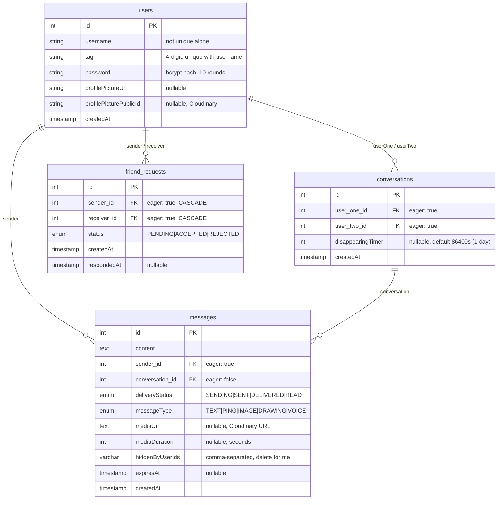

---
description:
alwaysApply: true
---

# CLAUDE.md — MVP Chat App

**Rules:**
- Always read this file before you every code change
- Update this file after every code change
- Single source of truth for agents — if CLAUDE.md says X, X is correct
- All code in English (vars, functions, comments, commits). Polish OK in .md files only


---

## 0. Quick Start

```bash
# Terminal 1: Backend + DB (auto hot-reload via NestJS watch mode)
docker-compose up

# Terminal 2: Flutter web (manual hot-reload — press 'r' in terminal)
cd frontend && flutter run -d chrome
```

**Before start:** Kill stale node processes: `taskkill //F //IM node.exe`

**Ports:** Backend :3000, Frontend :random (check terminal), DB :5433 (host) -> :5432 (container)

**Stack:** NestJS 11 + Flutter 3.x + PostgreSQL 16 + Socket.IO 4 + JWT + Cloudinary

**Run for phone (same WiFi):** Use `web-server`, not Chrome. Run: `cd frontend && .\run_web_for_phone.ps1` or `flutter run -d web-server --web-hostname 0.0.0.0 --web-port 8080 --dart-define=BASE_URL=http://YOUR_PC_IP:3000`. Backend CORS allows `192.168.*` and `10.*` in dev.

---

## 1. Architecture Overview


**State Management:** 3 providers (ChangeNotifier): `AuthProvider` (login/logout/token/user), `ChatProvider` (conversations/messages/friends/socket), `SettingsProvider` (themeMode). Services: `SocketService` (Socket.IO), `ApiService` (REST).

---

## 2. Database Schema



**TypeORM config:** `synchronize: true` -- column additions auto-apply on restart. No migrations.

**Key constraints:** `users` unique on `(username, tag)` — Discord-style handle `username#tag`. `friend_requests` index on `(sender, receiver)`. No cascade on User entity -- `deleteAccount()` manually cleans dependents. `conversations.delete()` must delete messages first (no cascade).

---

## 3. WebSocket API -- Complete Event Reference

**Connection:** `io(baseUrl, { auth: { token: JWT } })` — token in auth only (not query) to avoid URL/log leakage.
Gateway verifies JWT, stores `client.data.user = { id, username, tag }`, tracks `onlineUsers: Map<userId, socketId>`.

### 3.1 Message Events

| Client Emit | Server Emit (caller) | Server Emit (recipient) |
|---|---|---|
| `sendMessage` | `messageSent` | `newMessage` |
| `getMessages` | `messageHistory` (array) | -- |
| `sendPing` | `pingSent` | `newPing` |
| `messageDelivered` | -- | `messageDelivered` (to sender) |
| `markConversationRead` | -- | `messageDelivered` (READ) per msg |
| `clearChatHistory` | `chatHistoryCleared` | `chatHistoryCleared` |
| `deleteMessage` | `messageDeleted` | `messageDeleted` (for_everyone only) |

### 3.2 Conversation Events

| Client Emit | Server Emit (caller) | Server Emit (other) |
|---|---|---|
| `startConversation` | `conversationsList` + `openConversation` | -- |
| `getConversations` | `conversationsList` | -- |
| `deleteConversationOnly` | `conversationDeleted` + `conversationsList` | same |
| `setDisappearingTimer` | `disappearingTimerUpdated` | `disappearingTimerUpdated` |

### 3.3 Friend Events

| Client Emit | Server Emit (caller) | Server Emit (other) |
|---|---|---|
| `searchUsers` | `searchUsersResult` (UserPayload[]) | -- |
| `sendFriendRequest` | `friendRequestSent` OR auto-accept flow | `newFriendRequest` OR auto-accept |
| `acceptFriendRequest` | `friendRequestAccepted` + lists + `openConversation` | same |
| `rejectFriendRequest` | `friendRequestRejected` + `friendRequestsList` | -- |
| `getFriendRequests` | `friendRequestsList` + `pendingRequestsCount` | -- |
| `getFriends` | `friendsList` | -- |
| `unfriend` | `unfriended` + `conversationsList` + `friendsList` | same |

### 3.4 Key Payloads

**Message payload** (`messageSent` / `newMessage` / `pingSent` / `newPing`):
```typescript
{ id, content, senderId, senderEmail, senderUsername, conversationId,
  createdAt, deliveryStatus, messageType, mediaUrl, mediaDuration,
  expiresAt, tempId }
```

**Conversation payload** (`conversationsList` item):
```typescript
{ id, userOne: UserPayload, userTwo: UserPayload, createdAt,
  disappearingTimer, unreadCount, lastMessage: MessagePayload | null }
```

**Friend request payload:** `{ id, sender: UserPayload, receiver: UserPayload, status, createdAt, respondedAt }`

### 3.5 DTO Validation (class-validator)

| DTO | Fields | Notes |
|---|---|---|
| `SendMessageDto` | recipientId (int+), content (str 1-5000), expiresIn?, tempId?, messageType?, mediaUrl?, mediaDuration? | content validation skipped for VOICE/PING via `@ValidateIf`; mediaUrl validated as Cloudinary URL |
| `SearchUsersDto` | username (str 3-20, a-z 0-9 _) | |
| `SendFriendRequestDto` | recipientId (int+) | |
| `AcceptFriendRequestDto` / `RejectFriendRequestDto` | requestId (int+) | |
| `GetMessagesDto` | conversationId (int+), limit?, offset? | |
| `StartConversationDto` | recipientId (int+) | |
| `UnfriendDto` | userId (int+) | |
| `ClearChatHistoryDto` / `SetDisappearingTimerDto` / `DeleteConversationOnlyDto` / `SendPingDto` | conversationId or recipientId (int+) | separate files |
| `DeleteMessageDto` | messageId (int+), mode ('for_me' \| 'for_everyone') | separate file |

---

## 4. REST API

| Method | Path | Auth | Body / Params | Response |
|---|---|---|---|---|
| POST | `/auth/register` | -- | `{ username, password }` | 201: `{ id, username, tag }` |
| POST | `/auth/login` | -- | `{ identifier, password }` | 200: `{ access_token }` |
| POST | `/users/profile-picture` | JWT | multipart `file` (JPEG/PNG, max 5MB) | `{ profilePictureUrl }` |
| POST | `/users/reset-password` | JWT | `{ oldPassword, newPassword }` | 200 |
| DELETE | `/users/account` | JWT | `{ password }` | 200 (cascade deletes all data) |
| POST | `/messages/voice` | JWT | multipart `audio` (AAC/M4A/MP3/WebM/WAV, max 10MB) + `duration` + `expiresIn?` | `{ mediaUrl, publicId, duration }` |
| POST | `/messages/image` | JWT | multipart `file` (JPEG/PNG, max 5MB) + `recipientId` + `expiresIn?` | MessagePayload |

**Password rules:** 8+ chars, 1 uppercase, 1 lowercase, 1 number.

**Rate limits:** Login 5/15min, Register 3/h, Image 10/min, Voice 10/60s.

**Login identifier:** username or `username#tag` (e.g. `john#0427`). When multiple users share a username, use full handle.

**JWT payload:** `{ sub: userId, username, tag, profilePictureUrl }`. Frontend decodes via `jwt_decoder`.

**Audit logging:** Login success/failure, resetPassword, deleteAccount — Logger('Audit') to stdout.

---

## 5. Frontend -- Screens & Widgets

**Navigation:** AuthGate -> AuthScreen (login/register) OR MainShell (IndexedStack: Conversations, Contacts, Settings). Conversations/Contacts -> ChatDetailScreen. Conversations + button -> AddOrInvitationsScreen. Desktop >600px: sidebar+detail layout.

**Key screens:** AuthScreen (login by username or username#tag, `clearStatus()` on tab switch — DO NOT DELETE), ConversationsScreen (swipe-to-delete, `consumePendingOpen()` pattern), ChatDetailScreen (Timer.periodic 1s for `removeExpiredMessages()`, `markConversationRead` on open), AddOrInvitationsScreen (searchUsers -> 1 result auto-send, multiple results picker, `consumeFriendRequestSent()` pattern).

**Key widgets:** ChatInputBar (text+send+mic hold-to-record+action tiles), ChatActionTiles (Camera/Gallery/Ping/Timer/Clear/Drawing), ChatMessageBubble (TEXT/PING/IMAGE/DRAWING/VOICE, long-press -> delete for me/everyone), VoiceMessageBubble (scrubbable waveform, speed toggle 1x/1.5x/2x, long-press -> delete), ConversationTile (Dismissible swipe-to-delete, unread badge), TopSnackbar (all notifications — never use ScaffoldMessenger), AvatarCircle (stable cache-bust per profilePictureUrl).

---

## 6. Frontend -- State Management

### 6.1 ChatProvider (central hub)

**Files:** `providers/chat_provider.dart`, `providers/chat_reconnect_manager.dart` (exponential backoff), `providers/conversation_helpers.dart` (getOtherUserId/User/Username/DisplayHandle).

**Connect flow:** cancel reconnect -> clear ALL state -> dispose old socket + create new with `enableForceNew()` -> on connect: fetch conversations/friendRequests/friends + register 22 listeners -> delayed re-fetch 500ms if empty.

**Optimistic messaging:** Create temp message (id=-timestamp, SENDING, tempId) -> notifyListeners (shows immediately) -> emit sendMessage -> backend returns `messageSent` with tempId -> replace temp with real message.

**Reconnection:** `ChatReconnectManager`: exponential backoff capped at 30s, max 5 attempts, only when `intentionalDisconnect == false`.

### 6.2 Key Patterns

**consumePendingOpen:** Backend emits `openConversation` -> provider sets `_pendingOpenConversationId` -> screen calls `consumePendingOpen()` (returns id, clears it) -> `addPostFrameCallback` -> Navigator.pop(context, id). Used in AddOrInvitationsScreen, ConversationsScreen.

**consumeFriendRequestSent:** Same pattern for `friendRequestSent` event -> shows snackbar + Navigator.pop.

### 6.3 AuthProvider

Loads JWT from SharedPreferences on construction. `login()`: POST -> decode -> save. `logout()`: clear (keeps dark mode pref). `clearStatus()`: used by AuthScreen on tab switch — DO NOT DELETE.

### 6.4 Frontend Models

| Model | Key Fields | Notes |
|---|---|---|
| `UserModel` | id, username, tag, profilePictureUrl? | `displayHandle` getter → `username#tag`; `copyWith()` all fields |
| `ConversationModel` | id, userOne, userTwo, createdAt, disappearingTimer? | Immutable |
| `MessageModel` | id, content, senderId, conversationId, deliveryStatus, messageType, mediaUrl?, mediaDuration?, expiresAt?, tempId? | `copyWith()` for deliveryStatus, expiresAt, mediaUrl, mediaDuration |
| `FriendRequestModel` | id, sender, receiver, status, createdAt, respondedAt? | |

**Frontend-only enum value:** `MessageDeliveryStatus.failed` (not in backend).

---

## 7. Backend -- Service Architecture


**Delivery status:** SENT -> DELIVERED -> READ. Never downgrades (enforced via `DELIVERY_STATUS_ORDER` map).

**Friend request auto-accept:** If B already has pending request to A when A sends to B -> auto-accept both, create conversation, emit openConversation to both.

**Delete account cascade:** Verify password -> delete Cloudinary avatar -> delete messages per conversation -> delete conversations -> find-then-remove friend_requests -> remove user.

**Mappers:** `UserMapper`, `MessageMapper`, `ConversationMapper`, `FriendRequestMapper` — all have `toPayload()` method. Located in `chat/mappers/` and `messages/message.mapper.ts`.

**DTO validation:** `chat/utils/dto.validator.ts` — runtime validation via `class-transformer` + `class-validator`. Used by all chat service handlers.

---

## 8. Feature Details

### 8.1 Disappearing Messages

Three-layer expiration: (1) Frontend `removeExpiredMessages()` every 1s, (2) Backend `handleGetMessages()` filters expired, (3) Cloudinary TTL auto-delete (expiresIn + 3600s buffer).

**Config:** `conversations.disappearingTimer` (default 86400s). `null` = disabled. Timer starts on DELIVERY, not send.

**TypeORM gotcha:** `expiresAt` may be string or Date — always use `new Date(val).getTime()` for comparisons.

### 8.2 Voice Messages (Telegram-style)

**Recording:** Long-press mic -> recording via `record` package. Mic turns red + scales up. Drag mic to trash to cancel (trash opens at 60px proximity). Release outside trash -> upload + send. Timer via `ValueNotifier<int>` (prevents rebuild freeze). Format: AAC/M4A (native), WAV (web). Max 2 min, min 1s.

**Upload:** Optimistic message (SENDING) -> POST /messages/voice -> Cloudinary -> send via WebSocket. Failure -> FAILED status (retry on native only).

**Playback:** Lazy download, cached at `{appDocDir}/audio_cache/{messageId}.m4a`. Scrubbable waveform (tap/drag to seek). Speed toggle 1x/1.5x/2x via `just_audio`.

**Platform:** `permission_handler` on mobile only (`!kIsWeb`). mediaUrl validated as Cloudinary URL (prevents SSRF).

### 8.3 Delete Conversation vs Unfriend vs Clear History vs Delete Message

| Action | What's Deleted | Friend Preserved? | Event |
|---|---|---|---|
| Delete Conversation (swipe) | Messages + Conversation | Yes | `deleteConversationOnly` |
| Unfriend (long-press contacts) | FriendRequest + Conversation + Messages | No | `unfriend` |
| Clear History (action tile) | Messages only | Yes (conv too) | `clearChatHistory` |
| Delete for me (long-press msg) | Hidden for current user only | Yes | `deleteMessage` mode=for_me |
| Delete for everyone (long-press own msg) | Message hard-deleted for both | Yes | `deleteMessage` mode=for_everyone |

**Delete single message (WhatsApp/Telegram-style):** Long-press any message -> modal with "Delete for me" / "Delete for everyone". "Delete for me" adds userId to `hiddenByUserIds` (message stays in DB, hidden from that user). "Delete for everyone" — hard delete, **sender only**, emits `messageDeleted` to both. `getMessages` / `getLastMessage` / `countUnreadForRecipient` filter by hiddenByUserIds.

### 8.4 Other Features

**Unread badge:** Backend `countUnreadForRecipient()` (sender != user, status != READ, not expired). Frontend `_unreadCounts` map, incremented on `newMessage` when chat not active, cleared on open.

**Ping:** One-shot notification, empty content, `messageType=PING`. Uses conversation's `disappearingTimer`.

**Image messages:** POST /messages/image (JPEG/PNG, max 5MB). Creates `IMAGE` message with `mediaUrl`. Verifies friend relationship.

### 8.5 Username#Tag (Discord-style)

Each user has a 4-digit tag (1000–9999), random at registration. Display format: `username#tag` (e.g. `ziomek#0427`). **Username is unique** (case-insensitive) — registration throws "nickname is already taken" if username exists. Tag stays when username changes.

**Add-by-username#tag flow:** User enters full handle `username#tag` (e.g. `username#1234`) -> `searchUsers` emits `{ handle }` -> backend uses `findByUsernameAndTag`, returns 0 or 1 user. Note in Add tab: "#tag is in Settings, next to your nickname. Each #tag is unique."

**Display:** Settings: `username#tag` on one line. **Contacts** and **Conversations tab** and **Chat header** show username only (no tag). Tap avatar in chat header to reveal `username#tag` for 5 seconds (tag in accent color).

**Login:** Use username or `username#tag`.

**Migration:** Existing users get default tag `0000`. Run `backend/scripts/migrate-add-tags.ts` to assign random tags.

---

## 9. File Location Map

### Backend (`backend/src/`)

| Domain | Key Files |
|---|---|
| **Auth** | `auth/auth.service.ts`, `auth/auth.controller.ts`, `auth/jwt-auth.guard.ts`, `auth/jwt.strategy.ts` |
| **Users** | `users/user.entity.ts`, `users/users.service.ts`, `users/users.controller.ts` |
| **Conversations** | `conversations/conversation.entity.ts`, `conversations/conversations.service.ts` |
| **Messages** | `messages/message.entity.ts`, `messages/message.mapper.ts`, `messages/messages.service.ts`, `messages/messages.controller.ts` |
| **Friends** | `friends/friend-request.entity.ts`, `friends/friends.service.ts` |
| **Chat** | `chat/chat.gateway.ts`, `chat/services/chat-{message,conversation,friend-request}.service.ts` |
| **DTOs** | `chat/dto/chat.dto.ts` (main), `chat/dto/{send-ping,clear-chat-history,set-disappearing-timer,delete-conversation-only,delete-message}.dto.ts` |
| **Mappers** | `chat/mappers/{conversation,user,friend-request}.mapper.ts`, `messages/message.mapper.ts` |
| **Utils/Config** | `chat/utils/dto.validator.ts`, `cloudinary/cloudinary.service.ts`, `app.module.ts` |

### Frontend (`frontend/lib/`)

| Domain | Key Files |
|---|---|
| **Entry** | `main.dart`, `config/app_config.dart`, `constants/app_constants.dart` |
| **Models** | `models/{user,conversation,message,friend_request}_model.dart` |
| **Providers** | `providers/{auth,chat,settings}_provider.dart`, `providers/chat_reconnect_manager.dart`, `providers/conversation_helpers.dart` |
| **Services** | `services/socket_service.dart`, `services/api_service.dart` |
| **Screens** | `screens/{auth,main_shell,conversations,contacts,settings,chat_detail,add_or_invitations}_screen.dart` |
| **Widgets** | `widgets/{chat_input_bar,chat_action_tiles,chat_message_bubble,voice_message_bubble,conversation_tile,top_snackbar,avatar_circle}.dart` |
| **Theme** | `theme/rpg_theme.dart` |

---

## 10. How-To: Adding New Features

### Add a new WebSocket event:
1. Define DTO in `chat/dto/` with class-validator decorators
2. Add handler in `chat/services/chat-*.service.ts`
3. Add `@SubscribeMessage` in `chat/chat.gateway.ts` -> delegate to service
4. Add emit + listener in `services/socket_service.dart`
5. Pass handler from `ChatProvider.connect()`, handle state + `notifyListeners()`

### Add a new REST endpoint:
1. Add method in `*.service.ts`, route in `*.controller.ts` with `@UseGuards(JwtAuthGuard)`
2. Add API call in `services/api_service.dart`, call from provider/screen

### Add a new DB column:
1. Add to `*.entity.ts` (@Column) -> restart backend (auto-sync)
2. Update mapper if WebSocket payload, update frontend model (constructor, `fromJson()`, `copyWith()`)

---

## 11. Critical Rules & Gotchas

### TypeORM
- Always `relations: ['sender', 'receiver']` on friendRequestRepository queries — without: empty objects/crash
- Use find-then-remove for friend_requests delete — `.delete()` can't use nested relation conditions
- Always `new Date(val).getTime()` for expiresAt comparisons — TypeORM returns string or Date
- `deliveryStatus` never downgrades — enforced via `DELIVERY_STATUS_ORDER` map

### Frontend
- Use `showTopSnackBar()` — ScaffoldMessenger covers chat input bar
- `enableForceNew()` on Socket.IO reconnect — Dart caches socket by URL, old JWT reused
- Provider can't call Navigator — use `consumePendingOpen()` / `consumeFriendRequestSent()` patterns
- Guard `Platform` with `!kIsWeb` — `dart:io` crashes on web
- `copyWith` must include ALL fields — missing field = data silently lost
- Voice recording: mic must stay in widget tree — GestureDetector unmounts -> no events
- Timer via `ValueNotifier<int>` — overlay rebuilds freeze timer
- Multiple backends: if weird data, kill local `node.exe`, use Docker only
- `clearStatus()` in AuthProvider appears unused but is called from auth_screen.dart — DO NOT DELETE
- Always run `flutter analyze` before deleting "unused" methods

### Backend
- mediaUrl must be Cloudinary URL when provided — prevents SSRF; validated via `@Matches` regex
- Delete account cascade: msgs -> convs -> friend_reqs -> user (no cascade on User entity)
- `conversationsService.delete()` deletes msgs first (no cascade)
- Chat services: critical failures stop execution; non-critical (emit lists) log and continue

---

## 12. Environment & Configuration

### Environment Variables

| Variable | Required | Purpose |
|---|---|---|
| `DB_HOST`, `DB_PORT`, `DB_USER`, `DB_PASS`, `DB_NAME` | Yes | PostgreSQL connection |
| `JWT_SECRET` | Yes | JWT signing. **Production:** must be strong, no dev fallback |
| `CLOUDINARY_CLOUD_NAME`, `CLOUDINARY_API_KEY`, `CLOUDINARY_API_SECRET` | Yes | Media storage |
| `ALLOWED_ORIGINS` | No | CORS origins (comma-separated). **Production:** set to frontend URL(s) |
| `BASE_URL` | No | Frontend dart define; defaults to `http://{browser_host}:3000` |

### Production Checklist
1. **JWT_SECRET** – ≥32 chars, app fails to start if missing/weak in production
2. **ALLOWED_ORIGINS** – exact frontend URL(s), no LAN IPs in prod
3. **TypeORM** – `synchronize: true` only in dev; use migrations in prod
4. **Rate limits** – global 100 req/15min + per-route limits (see Section 4)
5. **Audit logs** – redirect stdout to log aggregation in production
6. **Template** – `backend/.env.example` -> `backend/.env`

### Docker Compose

| Service | Port | Notes |
|---|---|---|
| `db` (postgres:16-alpine) | 5433->5432 | Creds: postgres/postgres/chatdb |
| `backend` (node:20-alpine) | 3000 | Mounts `./backend:/app`, runs `npm install && npm run start:dev` |

Frontend runs locally: `flutter run -d chrome`

---

## 13. Recent Changes

**2026-02-19:**
- **Delete single message (WhatsApp/Telegram-style):** Long-press any message -> "Delete for me" / "Delete for everyone". "Delete for me" adds userId to `messages.hiddenByUserIds`; "Delete for everyone" hard-deletes (sender only). WebSocket `deleteMessage` / `messageDeleted`.
- **#tag visibility:** Contacts tab shows username only (no tag). Settings keeps username#tag. Chat header: tap avatar to reveal username#tag for 5 seconds, with #tag in app accent color (RpgTheme.primaryColor).
- **Typing indicators:** A types → B sees "typing..." in AppBar title and conversation list subtitle. Auto-clears after 3s of inactivity or immediately when message arrives. Backend: `typing` event relay → `partnerTyping` emit (no DB, online-only). Frontend: 300ms debounce in ChatInputBar, `_typingStatus`/`_typingTimers` maps in ChatProvider, `isPartnerTyping(convId)` getter. Timers cancelled on connect/disconnect.

**2026-02-17:**
- **Username#tag:** 4-digit tag per user (unique with username). Display `username#tag` in Settings, Contacts, ConversationTile, chat header. Add-by-username: `searchUsers` -> picker when multiple. Login by username or username#tag. SendFriendRequest/StartConversation use recipientId.
- mediaUrl validation (Cloudinary URL regex, prevents SSRF), audit logging, Socket.IO token in auth only, Helmet middleware, RegisterDto password validation
- Production security: JWT fails without secret in prod, strict CORS in prod, `.env.example`
- Backend: 22 unit tests (AuthService, validateDto, mappers). `npm test`
- Refactoring: ChatProvider extracted helpers (ChatReconnectManager, conversation_helpers), chat-friend-request.service reduced to ~428 lines, MessageMapper.toPayload(), dead code/debug prints removed (-454 lines), 3 dead screens deleted
- Voice: drag-to-trash cancel, scrubbable waveform (Telegram-style)
- Flutter deprecations: `withValues(alpha:)`, RadioGroup migration, direct deps added

**2026-02-14–16:**
- Voice messages: hold-to-record, optimistic UI, Cloudinary TTL, lazy playback+caching, web support (WAV), ValueNotifier timer fix, Telegram-style drag
- Contacts tab (replaces Archive), swipe-to-delete conversations, clear chat history, ping display fix, default 1-day disappearing timer

---

## 14. Known Limitations & Tech Debt

### Limitations
- Add by username (search returns list; if multiple, picker). No fuzzy search. No typing indicators, no message edit/delete, no push notifications
- No unique constraint on `(sender, receiver)` in friend_requests
- Message pagination: simple limit/offset (default 50), `_conversationsWithUnread()` has N+1

### Tech Debt
- 28 unit tests (no DB). Run: `npm test`
- Manual E2E scripts in `scripts/`
- Large files: `chat_provider.dart` (~654 lines), `chat-friend-request.service.ts` (~428 lines)

---

**Maintain this file.** After every code change, update the relevant section so an agent reading only CLAUDE.md understands the current state.
